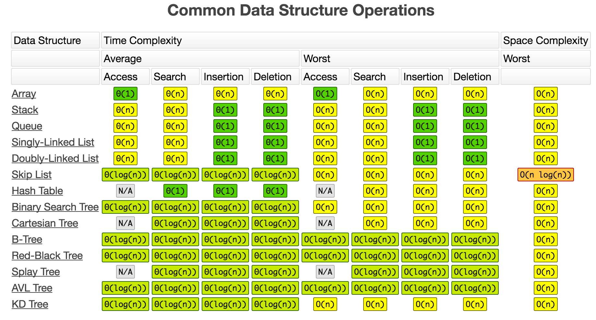
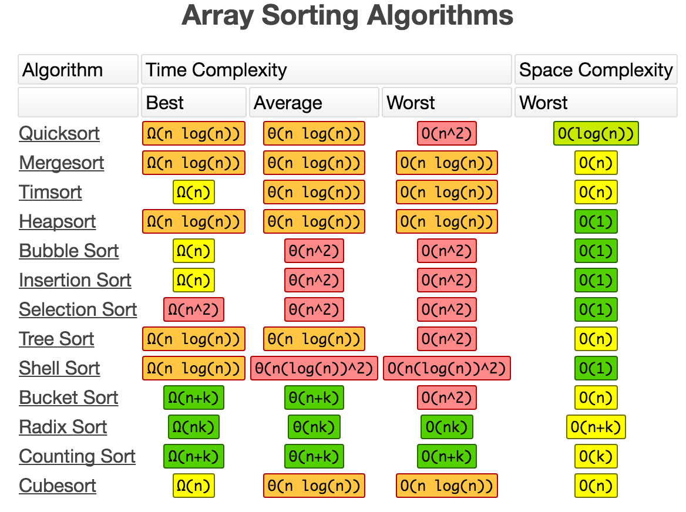

## Characteristics of Data Structures:

Data Structure   | Advantages   | Disadvantages
-----------------| -------------| --------------
Array            | Quick insertion, very fast access if index known | Slow search, slow deletion, fixed size
Ordered array    | Quicker search than unsorted array | Slow insertion and deletion, fixed size
Stack            | Provides last-in, first-out access | Slow access to other items
Queue            | Provides first-in, first-out access| Slow access to other items
Linked list      | Quick insertion, quick deletion    | Slow search
Binary tree      | Quick search, insertion, deletion (if tree remains balanced) | Deletion algorithm is complex
Red-black tree   | Quick search, insertion, deletion. Tree always balanced | Complex
2-3-4 tree       | Quick search, insertion, deletion. Tree always balanced. Similar trees good for disk storage | Complex
Hash table       | Very fast access if key known. Fast insertion | Slow deletion, access slow if key not known, inefficient memory usage
Heap             | Fast insertion, deletion, access to largest item | Slow access to other items
Graph            | Models real-world situations | Some algorithms are slow and complex

### Big-O Complexity Chart

### Common Data Structure Operations

### Array Sorting Algorithms

