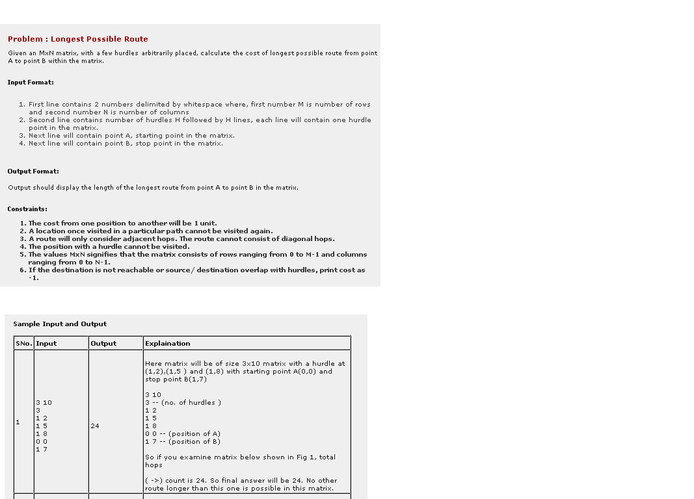

September 21, 2016
---------------
Given: sorted array of integers Return: sorted array of squares of those integers Ex: [1,3,5] -> [1,9,25] Integers can be negative.

September 10, 2016
---------------
Design a HTTP response service that will allow sync and async download. What classes would you create and the methods used with paramerters and return types.

August 09, 2016
---------------
Convert a number to English representation. Ex: Input : 100 Output : One Hundred.

July 30, 2016
---------------
How do I find the longest possible route in a matrix? There are some hurdles in the path. 

July 14, 2016
---------------
Given Nodes such as

July 02, 2016
---------------
You have an array of unique integer numbers and only one operation: MoveToFront(x) that moves given number to the beginning of the array. Write a program to sort the array using the minimum possible number of MoveToFront() calls.

June 29, 2016
---------------
Given an array of positive integers and a target total of X, find if there exists a contiguous subarray with sum = X [1, 3, 5, 18] X = 8 Output: True X = 9 Output: True X = 10 Output: False X = 40 Output :False

May 17, 2016
---------------
A museum was represented by a square matrix that was filled with O, G, and W where O represented open space G represented guards, and W represented walls. Write a function that accepts the square matrix and returns another square matrix where all of the O's in the matrix are replaced with the number of how many spaces they are away from a guard, without being able to go through any walls.

May 16, 2016
---------------
You are given a string "abc" which is encoded like "123" where alphabets are mapped like a => 1 to z => 26. Now find out how many string can be formed by reverse engineering encode string "123". For ex. given string "123" we can form 3 string "abc"(1,2,3), "lc" (i.e 12,3), "aw"(1,23). for string "1234" we have following possible combinations, I might be missing some of them but you get the idea {12, 3, 4} {1, 23, 4} {1, 2, 3, 4}

May 10, 2016
---------------
// Reverse the words. Given a String that contains words separated by single space, reverse the words in the String. You can assume that no leading or trailing spaces are there. // For example: "Man bites dog" => "dog bites Man”

May 10, 2016
---------------
Select Kth largest value in the array. Given an unsorted array of size n, and a value k. Select the kth largest value from the array. For example: Array is [5, 3, 9, 1], n is 4 k = 0 => 9 k = 1 => 5 k = 3 => 1

April 28, 2016
---------------
Given two sorted linked lists of integers write an algorithm to merge the two linked lists such that the resulting linked list is in sorted order. You are expected to define the data structure for linked list as well. Analyze the time and space complexity of the merge algorithm.

April 02, 2016
---------------
There are N coins with coordinates (x, y) where x >0 and y >0 You start at (0, 0) and you can only do steps of form (dx, dy) where dx >0 and dy > 0 Print the maximum number of coins that you can collect. Clarification: you can do as many moves as you wish, the point is to collect maximum number of coins. If you are located at position (a, b) you may jump to position (a+dx, b+dy) for all dx > 0 and dy > 0 @krbchd: Your algorithm may output incorrect values. Suppose there are points (5, 7), (5, 8), (5, 9) for y coordinates LIS will output 7, 8, 9, however since these points are on the same x axis, you can choose only one of them.

March 15, 2016
---------------
GIven a string "str" and pair of "N" swapping indices, generate a lexicographically largest string. Swapping indices can be reused any number times. Eg 1) String = "abdc" Indices: (1,4) (3,4) Answer: cdba, cbad, dbac,dbca ​you should print only "dbca" which is lexicographically largest.

February 26, 2016
---------------
Given the root of a binary tree containing integers, print the columns of the tree in order with the nodes in each column printed top-to-bottom.

February 25, 2016
---------------
Given an array and a number, add it in such a way where array is [0,0,1] and number is 4 output will be [0,0,5] Example 2 : array is [1] and number is 9 output will be [1,0]

February 22, 2016
---------------
Given a set of numbers {x1, x2, x3, x4, ..., xN} (N>=3) a set of its pairwise sums is {x1+x2, x1+x3, x1+x4, x2+x3,x2+x4,x3+x4, ...,}. (That is s_k = x_i + x_j where i != j) Restore a set of numbers given a set of its pairwise sums. Note: you don't know given some k, to which i and j it refers, (i.e. input is given in undefined order) EDIT: couldn't comment, so here is clarification Example:

February 19, 2016
---------------
Given a string where in each word letters were randomly shuffled and after that words were written without spaces (lets call it X). Also you have a dictionary. The task is to return all possible strings S that can be transformed into the string X and all words in S are from dictionary.

February 12, 2016
---------------
Given two arrays/Lists (choose whatever you want to) with sorted and non intersecting intervals. Merge them to get a new sorted non intersecting array/list. Eg: Given: Arr1 = [3-11, 17-25, 58-73]; Arr2 = [6-18, 40-47]; Wanted: Arr3 = [3-25, 40-47, 58-73];

January 27, 2016
---------------
Task schedule: given a sequence of task like A B C(means 3 different tasks), and a coldtime, which means you need to wait for that much time to start next [same] task. Now---- Input: string, n Output: the best task-finishing sequence. eg. input: AAABBB, 2 Output: AB_AB_AB ( "_" represents do nothing and wait)

January 09, 2016
---------------
Given a decimal number, write a function that returns its negabinary (i.e. negative 2-base) representation as a string.

December 26, 2015
---------------
Given a forest of balanced binary trees and two nodes, n1 and n2, find the closest common parent of n1 and n2. Nodes have parameters "parent", "left" and "right", and you cannot access the values of the nodes. If n1 and n2 are not on the same tree, return NULL. Try to do this in O(log(n)) time and O(1) space.

December 25, 2015
---------------
Given an undirected graph and a node, modify the graph into a directed graph such that, any path leads to one particular node.

December 13, 2015
---------------
Given integer k and a subset S of set {0, 1, 2, ..., 2^k - 1} Return the count of pairs (a, b) where a and b are from S and (a < b) and (a & b == a) & here is bit-wise and. Do it faster than O((2^k)^2), assume k <= 16 Example: 0b111 0b101 0b010 Answer: 2 0b110 0b011 0b101 Answer: 0

November 05, 2015
---------------
Given a random string S and another string T with unique elements, find the minimum consecutive sub-string of S such that it contains all the elements in T. example: S='adobecodebanc' T='abc' answer='banc'

November 02, 2015
---------------
Given a set of ranges: (e.g. S = {(1, 4), (30, 40), (20, 91) ,(8, 10), (6, 7), (3, 9), (9, 12), (11, 14)}. And given a target range R (e.g. R = (3, 13) - meaning the range going from 3 to 13). Write an algorithm to find the smallest set of ranges that covers your target range. All of the ranges in the set must overlap in order to be considered as spanning the entire target range. (In this example, the answer would be {(3, 9), (9, 12), (11, 14)}.

October 28, 2015
---------------
Given an array of positive integers (excluding zero) and a target number. Detect whether there is a set of consecutive elements in the array that add up to the target. Example: a = {1, 3, 5, 7, 9} target = 8 output = true ({3, 5}) or target = 15 output = true : {3, 5, 8} but if target = 6, output would be false. since 1 and 5 are not next to each other.

October 28, 2015
---------------
Given an array of integers. Modify the array by moving all the zeros to the end (right side). The order of the other elements doesn't matter.

October 28, 2015
---------------
Given a dictionary containing a list of words, a starting word, and an ending word, return the minimum number of steps to transform the starting word into the ending word. A step involves changing one letter at a time to a valid word that is present in the dictionary. Return null if it is impossible to transform the starting word into the ending word using the dictionary. Example: Starting word: cat Ending word: dog cat -> cot -> cog -> dog ('cot' and 'cog' are in the dictionary) return 3

October 27, 2015
---------------
Given predicted stock prices for next n days for a stock e.g : 10, 30, 42, 15, 20, 50, 10, 25 find the maximum profit that can be made with a single buy-sell transaction. If no profit can be made return 0. In the example buying at 15 and selling at 50 gives maximum profit. Note that the two prices are neither minimum nor maximum in the array.

October 26, 2015
---------------
We have an array of objects A and an array of indexes B. Reorder objects in array A with given indexes in array B. Do not change array A's length. example:

October 22, 2015
---------------
You are given a set of points on x axis (consumers) Also you are given a set of points on a plane (producer) For every consumer print the nearest producer. Wanted something better than O(n^2) time. Example: consumers: 1 5 7 producers: (0, 3), (1,1), (3, 2), (8, 10), (9, 100) Answer: for 1 nearest producer is (1, 1), for 5 nearest is (3, 2), for 7 nearest is (3, 2) Follow-up question: now both sets are sorted by x coordinate. Could you come up with a linear algorithm?

October 07, 2015
---------------
Given n, return 1 ^ 2 ^ 3 ^ ... ^ n Where ^ is binary xor. Note: n is a 64-bit number, and 1<<63 is a valid n for this problem. Examples:

October 06, 2015
---------------
Given an array of positive, unique, increasingly sorted numbers A, e.g. A = [1, 2, 3, 5, 6, 8, 9, 11, 12, 13]. Given a positive value K, e.g. K = 3. Output all pairs in A that differ exactly by K. e.g. 2, 5 3, 6 5, 8 6, 9 8, 11 9, 12 what is the runtime for your code?

October 05, 2015
---------------
You are given a permutation arr[N]. E.g. arr[3] = {2, 1, 0} or arr[5] = {0,1,2,4,3}; Then you can prepare somehow and then start serving requests: request(a, b, k) = sorted(arr[a:b])[k], that is, k-th order statistic on slice [a:b] of arr. E.g. if arr is [3,4,5,0,1,2] and a = 2 and b = 5, then arr[a:b] = [5,0,1] and let k = 2, so we sort it - get [0,1,5] and take k-th element, that is - 5. Implement request(a, b, k) function. You can preprocess input data, that is, assume there will be only one array and many request() calls.

September 29, 2015
---------------
Design Live comments. If your facebook.com homepage is open with bunch of feeds and if someone comments on those feeds, the comments should automatically show up in facebook.com home page without refreshing the page. Feeds could be a simple status update by a friend, post in a group, post by a person you're following, post in a page you've liked etc. Few things what they are looking for - 1. How do you solve it initially and how do you scale it? 2. How do you scale push model in-case if you choose PUSH model to solve it? 3. If push cannot scale how do you solve it? 4. How pull model solves it? 5. When will you use push vs pull?

September 23, 2015
---------------
Write Program for String Permutations using most efficient algorithm. Can you solve problem in O(n) time ?

September 23, 2015
---------------
Conflict resolution in Multi Master systems.

September 23, 2015
---------------
Design a URL shortener service

September 23, 2015
---------------
check a binary tree is a binary search tree

August 04, 2015
---------------
Write a function to check if a string matches a regex patter. Note that you only have to deal with patterns containing "*". Also, note that the pattern can't start with "*". Some examples: isMatch(“aa”,”a”) → false isMatch(“aa”,”aa”) → true isMatch(“aaa”,”aa”) → false isMatch(“aa”, “a*”) → true isMatch(“aa”, “*”) → true isMatch(“ab”, “*”) → true isMatch(“ab”, “*”) → true isMatch(“b*a”, “a”) → true isMatch(“a*a”, “a”) → true isMatch(“aab”, “c*a*b”) → true

August 04, 2015
---------------
Given an array of integer, find the maximum drop between two array elements, given that second element comes after the first one.

August 02, 2015
---------------
On a given array with N numbers, find subset of size M (exactly M elements) that equal to SUM.

July 20, 2015
---------------
Find the in-order successor of a node in BST

July 14, 2015
---------------
Design a data structure that supports kind of full text search but in numbers. We are given file with lot of 10-digits numbers, for example: 1234 567 890 4124 123 123 3123 123 322 On a given number X we should return all numbers that contain X. For example, if the number 123 was given, we should return all numbers (from the list above) because 123 is in all of them. If the number 41 was given we should return only the middle number - because the number 41 is only in it.

July 13, 2015
---------------
Design Facebook Messenger backend

July 12, 2015
---------------
Given an array of contacts with phone numbers/emails you should detect and union identical contacts. For example, given the following contacts array: [ [ "John", "john@gmail.com", "john@fb.com"], [ "Dan", "dan@gmail.com", "+1234567"], [ "john123", "+5412312", "john123@skype.com"], [ "john1985", "+5412312", "john@fb.com"] ] We can see that john1985, John and john123 are the same person by their contact information. We should output [[ 0, 2, 3], [1]] (0,2,3 are the same person and 1 is another one)

May 21, 2015
---------------
Search in a sorted rotated array.

May 21, 2015
---------------
Merge K sorted singly linked list

May 21, 2015
---------------
paint a list of N houses and M colors, each combination has cost, minimize the total cost without color in row.

May 07, 2015
---------------
Given array A of size N, using function Random(returns random number between 0 and 1) implement function that will return array of size N with randomly shuffled elements of the array A. You shoul give only algo.

May 05, 2015
---------------
We know a string is Palindrome if it is the same reading from both sides. Now we define the following string also Palindrome: A man, a plan, a canal, Panama! Write a code that returns if an string is palindrome and it should return true for above input. (Without directly saying, I should conclude that I have to only consider alphanumerical characters in a string). In addition, we assume the string is very long and we can not keep a copy of this string or even a copy of preprocessed version of this string. Therefore the result should be returned with the first sweep of the string.

April 22, 2015
---------------
Given a singly linked list, swap the list items in pairs (reconnect the pointers, not simply swap the values). For example: Before: A->B->C->D After: B->A->D->C

April 17, 2015
---------------
you have a interface called Op and a Filter interface interface Op<T> { public boolean hasNext(); public boolean<T> next(); } interface Filter<T1, T2> { public boolean filter(T1 t1, T2 t2); } design a MutualOp that has below API, MutualOp should return the ops that combine op1 and op2, also should meet with the filter class MutualOp implements Op{ public MutualOp(Op left, Op right, Filter<Op, Op> filter) { this.left = left; this.right = right; this.filter = filter; } public boolean hasNext { ...... } public T next { ...... } }

April 17, 2015
---------------
calculate minimum h-index for a sorted integer array(http://en.wikipedia.org/wiki/H-index)

April 17, 2015
---------------
Assuming you're playing one game that you need guess a word from a dictionary. You're given a machine you can try to guess the word, the machine will return how many characters has been matched by your guess. Design a system to crack the word.

April 17, 2015
---------------
Permutate a list of string this question is supposed permutate the characters instead of who string, as input example {"red", "fox", "super" }, the expected output is rfs rfu rfp rfe rfr ros rou rop roe ror rxs rxu rxp rxe rxr efs efu efp efe efr eos eou eop eoe eor exs exu exp exe exr dfs dfu dfp dfe dfr dos dou dop doe dor dxs dxu dxp dxe dxr

April 17, 2015
---------------
A 2D array filled with integer, define a flow from one point to its neighbor only if the value of current point is not less than its neighbor's value. Consider up edge and left edge as east coast, bottom edge and right edge as west coast, find all position that it can flow to east coast and west cost both

April 17, 2015
---------------
Sort an integer array with three functions: findMin(), findMedium(), findMax().

April 16, 2015
---------------
/** * Find if the given list of recurring weekly intervals covers the * entire time. Times are given up to a second. * * You can take the input intervals in the number of seconds since * the beginning the week or any other format you prefer. * * ---Example 1--- * Input: * Tuesday 9AM - Sunday 9AM * Sunday 8:00:20AM - Wednesday 3AM * * Output: * true * * ---Example 2--- * Input: * Tuesday 9AM - Sunday 9AM * Sunday 8:00:20PM - Tuesday 8AM * * Output: * false */

April 16, 2015
---------------
/* For each node in a binary tree find the next right node on the same depth. Write a function that takes root node and populates "next" with the answer for each node. A / \ B -> C / / \ D -> F-> G / \ H -> I class Node { Node left; Node right; Node next; // <-- answer should be stored here }; B.next = C D.next = F F.next = G H.next = I {A, C, G, I}.next = null */

April 16, 2015
---------------
Pangram

April 16, 2015
---------------
In-place Palindrome Check

April 16, 2015
---------------
dutch national flag w/ get rank followup

April 15, 2015
---------------
given an array (list) of integers return true(boolean function) if two of the numbers add to 12.

April 08, 2015
---------------
N queen problem. In NXN chess board, you have to arrange N queens such that they do not interfere each other. Following is how you define interference of queens. 1. Two queens cannot be on the same diagonal 2. Two queens cannot be in same horizontal or vertical line 3. Queen can jump like a knight. So, two queens cannot be at a position where they can jump two and half steps like a knight and reach the other queen. You should return the possible ways to arrange N queens on a chess board. This was a tech screen, but since I was local, they called me in their office rather than phone interview. Hint: Don't try too hard, the best solution is n!

April 05, 2015
---------------
I needed to develop next system: We have a lot of servers. Every server generate logs. Every log has two data types: first is numeric metrics. These numeric metrics are integer. Second is strings. We need to collect logs from all servers on other server (storage). Then we have to execute queries and get some data from storage. In our queries we have to use numeric metrics and strings as well. For numerics metrics we have to be able get aggregation data as well. Develop Storage server, database. Describe how will you scale this system, what database will you use, how will you save data and how will you execute this queries.

March 30, 2015
---------------
Given an array such that every next element differs from the previous by +/- 1. (i.e. a[i+1] = a[i] +/-1 ) Find the local max OR min in O(1) time. The interviewer mentioned one more condition that the min or max should be non-edge elements of the array Example: 1 2 3 4 5 4 3 2 1 -> Local max is 5 1 2 3 4 5 -> No local max or min exists 5 4 3 2 1 -> No local max or min exists

March 24, 2015
---------------
write a function that calculates the minimum number of meeting rooms that can accommodate given schedules input: same output: # of rooms Also back to back events are allowed e.g. {2,5} {5,9} correct o/p:1

March 24, 2015
---------------
write a function that detects conflicts in given meeting schedules input: a list of intervals, [(s1, e1), (s2, e2), ] output: return True if there's any conflict, False otherwise

March 19, 2015
---------------
Given a tokenized PHP file, give me a map from class to list of functions

March 14, 2015
---------------
There are 3 romms in which party is going on lets say room A, B, C. Guests are coming one by one and you have to tell the guest which room to enter. At any point of time each room has to maintain a percentage Lets say the percentage that each room has to maintain is A- 20% , B-30% , C- 50%. You can maintain total count of each room and keep on adding count to respective room as the new guest enters each room. How would you go about it. What formula would you use. Give a generalise formula so that it works if no. of rooms increase.

March 14, 2015
---------------
You are given a 2d rectangular array of positive integers representing the height map of a continent. The "Pacific ocean" touches the left and top edges of the array and the "Atlantic ocean" touches the right and bottom edges. - Find the "continental divide". That is, the list of grid points where water can flow either to the Pacific or the Atlantic. Water can only flow from a cell to another one with height equal or lower. Example: Pacific ~ ~ ~ ~ ~ |__ ~ 1 2 2 3 (5) ~ ~ 3 2 3 (4)(4) ~ ~ 2 4 (5) 3 1 ~ ~ (6)(7) 1 4 5 ~ __ (5) 1 1 2 4 ~ |~ ~ ~ ~ ~ Atlantic The answer would be the list containing the coordinates of all circled cells: [(4,0), (3,1), (4,1), (2,2), (0,3), (1,3), (0,4)]

March 14, 2015
---------------
Implement stairs(N) that (collect the solutions in a list) prints all the ways to climb up a N-step-stairs where one can either take a single step or double step. We'll use 1 to represent a single step, and 2 to represent a double step. stairs(3) 111 12 21

March 09, 2015
---------------
A robot has to move in a grid which is in the form of a matrix. It can go to 1.) A(i,j)--> A(i+j,j) (Down) 2.) A(i,j)--> A(i,i+j) (Right) Given it starts at (1,1) and it has to go to A(m,n), find the minimum number of STEPS it has to take to get to (m,n) and write public static int minSteps(int m,int n) For instance to go from (1,1) to m=3 and n=2 it has to take (1, 1) -> (1, 2) -> (3, 2) i.e. 2 steps

March 06, 2015
---------------
Given an m x n matrix where each row element is sorted, but the columns do not appear in sorted order, write a function to print each matrix element in sorted order. Example matrix: matrix = [ [20, 40, 80], [5, 60, 90], [45, 50, 55] ] Your function should print 5, 20, 40, 45, 50, 55, 60, 80, 90. Add on: Assume that we are space-constrained such that we can only hold one row in memory at a time. Optimize your function to work under such constraints as efficiently as possible.

February 27, 2015
---------------
Question: Given a sequence of positive integers A and an integer T, return whether there is a continuous sequence of A that sums up to exactly T Example [23, 5, 4, 7, 2, 11], 20. Return True because 7 + 2 + 11 = 20 [1, 3, 5, 23, 2], 8. Return True because 3 + 5 = 8 [1, 3, 5, 23, 2], 7 Return False because no sequence in this array adds up to 7

February 25, 2015
---------------
Given a string containing letter, digit, and other characters, write a function to check palindrome for only letter and digit. The implementation need to be in-place, no extra memory is allowed to create another string or array. For example: "ABA" is palindrome "A!#A" is palindrome "A man, a plan, a canal, Panama!" is palindrome

February 24, 2015
---------------
Write a program that reverses a linked list without using more than O(1) storage.

February 24, 2015
---------------
Write a program that answers YES/NO search queries containing * placeholders. Example: if the data you have is (hazem, ahmed, moustafa, fizo), then you should answer as follows for:
```
ahmed: YES
m**stafa: YES
fizoo: NO
fizd: NO
*****: YES
****: YES

**: NO
```
Your program should be able to answer each search query in O(1).

February 23, 2015
---------------
Input: A string equation that contains numbers, '+' and '*' Output: Result as int. For example: Input: 3*5+8 (as String) Output: 23 (as int)

February 23, 2015
---------------
Given a class Range

February 22, 2015
---------------
Convert a binary tree into a In Order traversal circular list re-purposing the node's pointers Left & Right as Previous and Next respectively. Hint: A single node Left & Right points to itself. Note: This is not a binary search tree.

February 04, 2015
---------------
You are given a set of unique characters and a string. Find the smallest substring of the string containing all the characters in the set. ex: Set : [a, b, c] String : "abbcbcba" Result: "cba"

January 31, 2015
---------------
First they did ask to find pattern of this

January 28, 2015
---------------
Completely blew it on this question today. 1.) Given an array, find the maximum difference between two array elements given the second element comes after the first. For example. array = [1,2,3,4,5,6,7] We can take the difference between 2 and 1 (2-1), but not the different between 1 and 2 (1-2). This question is super easy, I solved it within minutes of getting of the phone. I came up with an O(n^2) solution over the phone. My improved solution was O(n).

January 22, 2015
---------------
It started with simple behavioral questions like, why facebook, cultural fit questions etc. They asked simple question.

January 17, 2015
---------------
Inplace reverse a sentence You given a sentence of english words and spaces between them. Nothing crazy: 1) no double spaces 2) no empty words 3) no spaces at the ends of a sentence

January 17, 2015
---------------
The closest common ancestor in a tree forest.

January 16, 2015
---------------
Design a URL system. He even wanted to know what kind of algorithm to use, improve the speed, availability etc.

January 16, 2015
---------------
Given a 4 X 4 game slot that has random alphabets in all the slots Write a function that takes the keyboard and the word as input and returns true if the word can be formed False otherwise. A word can be formed on the board by connecting alphabets adjacent to each other (horizontal, vertical and diagonally) Same alphabet should not be reused.

January 16, 2015
---------------
Given a set of n people, find the celebrity. Celebrity is a person who: 1. Knows only himself and no one else 2. Every one else knows this person You are given the following helper function: bool knows(i, j); Returns: True: If i knows j False: otherwise I proposed the O(n2) algorithm at first but he wanted me to improve on it. He wanted an O(n) algorithm

January 16, 2015
---------------
You have a list of words with ranking. Now you need to create a function that will take this list as input and provide a way so that a T9 keyboard can provide three top results of probable words based on rankings for the numbers punched in.

January 15, 2015
---------------
Tree to List: convert a binary tree to a circular doubly-linked list

January 12, 2015
---------------
roll two dice, what is the probability of rolling no sixes?

January 09, 2015
---------------
Given an array of integers, return true if there're 3 numbers adding up to zero (repetitions are allowed) {10, -2, -1, 3} -> true {10, -2, 1} -> true -2 + 1 +1 =0

January 09, 2015
---------------
Find the maximum number of non-intersecting events in a calendar.

January 09, 2015
---------------
Write a function to print the rows of a binary tree, terminating each row with a carriage return

January 05, 2015
---------------
Given a Tree:

December 31, 2014
---------------
Given an array of ages (integers) sorted lowest to highest, output the number of occurrences for each age. For instance: [8,8,8,9,9,11,15,16,16,16] should output something like: 8: 3 9: 2 11: 1 15: 1 16: 3 This should be done in less than O(n).

December 22, 2014
---------------
Print a BST such that it looks like a tree (with new lines and indentation, the way we see it in algorithms books).

December 19, 2014
---------------
Write a function that takes the following inputs and gives the following outputs. Input: A list of points in 2-dimensional space, and an integer k Output: The k input points closest to (5, 5), using Euclidean distance Example: Input: {(-2, -4), (0, 0), (10, 15), (5, 6), (7, 8), (-10, -30)}, k = 2 Output: {(5, 6), (7, 8)}

December 19, 2014
---------------
An efficient way to sort patient files in an array of just 3 types 'High-importance', 'Mid-importance', 'Low-importance' which are in an arbitrary order (unsorted). The output preference should start with the highest. 1. High-importance 2. Mid-importance 3. Low-importance [high,low,low,med,high,low] ps I was told to take advantage of the fact that they are just only 3 types.

December 15, 2014
---------------
There is a list of rectangles and a list of points in a 2d space. Note that the edge of each rectangle are aligned to XY axis. question is how to find rectangles with point or points inside

December 13, 2014
---------------
Given a list of strings, return a list of lists of strings that groups all anagrams. Ex. given {trees, bike, cars, steer, arcs} return { {cars, arcs}, {bike}, {trees, steer} } m = # of words n = length of longest word I solved this in O(m * n * log n) time.

December 05, 2014
---------------
Array of size (n-m) with numbers from 1..n with m of them missing. Find one all of the missing numbers in O(log). Array is sorted. Example: n = 8 arr = [1,2,4,5,6,8] m=2 Result has to be a set {3, 7}.

December 02, 2014
---------------
You are given an array of non-negative integers (0, 1, 2 etc). The value in each element represents the number of hops you may take to the next destination. Write a function that determines when you start from the first element whether you will be able to reach the last element of the array. if a value is 3, you can take either 0, 1, 2 or 3 hops. For eg: for the array with elements 1, 2, 0, 1, 0, 1, any route you take from the first element, you will not be able to reach the last element.

November 27, 2014
---------------
Given an array of integers. Move all non-zero elements to the left of all zero elements.

November 27, 2014
---------------
There's a new language which uses the latin alphabet. However, you don't know the order among letters. It could be: a b c d ... as it could also be: b e z a m i ... You receive a list of words lexicographically sorted by the rules of this new language. From this list, derive one valid particular ordering of letters in this language.

November 20, 2014
---------------
Write a program to find pattern. 0: 1 1: 11 2: 21 3: 1211 4: 111221 5: 312211 Iterate over the previous number, and find count for same number number. Append that count before number. e.g., public String pattern(int input){} If input = 4, function should return 111221.

November 17, 2014
---------------
Let's say there is a double square number X, which can be expressed as the sum of two perfect squares, for example, 10 is double square because 10 = 3^2 + 1^2 Determine the number of ways which it can be written as the sum of two squares

November 14, 2014
---------------
write an algorithm to decide weather a string is a palindrome. Ignore any non-letter characters in the the string. Ignore capital/lower case. Space complexity O(1) for example, the following should return true: A man, a plan, a canal -- Panama!

November 12, 2014
---------------
Suppose we have array of N numbers. We will define N functions on this array. Each function will return the sum of all numbers in the array from Li to Ri ( Li is left index, Ri is right index). Now we have 2 types of queries: Type1: 1 x y Change the xth element of the array to y Type2: 2 l r Return the sum of all functions from m to n. Input type: First Line is the size of the array i.e. N Next Line contains N space separated numbers Ai denoting the array Next N line follows denoting Li and Ri for each functions. Next Line contains an integer Q , number of queries to follow. Next Q line follows , each line containing a query of Type 1 or Type 2 Here is an example: Input: 5 1 2 3 4 5 1 2 3 4 1 4 1 5 3 5 5 1 1 5 2 2 4 2 1 3 1 4 5 2 1 5 Output: 40 28 63 Explanation: Function 1 is sum of values from index 1 to index 2 = 1+2=3 So , F1=3 Similarly, F2=3+4=7 F3=1+2+3+4=10 F4=15 F5=12 Now when I query 1 1 5 means it is type 1 query, so we replace value at index 1 by 5. So our new array is, 5 2 3 4 5 and F1=7 F2=7(unchanged) F3=14 F4=19 F5=12(unchanged) Then next query is 2 2 4 means give sum of all functions from index 2 to 4. So, ans= 7+14+19 =40 (output 1) Similarly are other 2 outputs. Index are 1 based in example. Comment me if you are not clear with question. Edit: I know one can do it with naive approach or using segment tree. But they wanted more faster way to do it.

November 01, 2014
---------------
Suppose we are given a set L of n line segments in the plane, where the endpoints of each segment lie on the unit circle x^2 + y^2 = 1, and all 2n endpoints are distinct. Describe and analyze an algorithm to compute the largest subset of L in which no pair of segments intersects.

October 31, 2014
---------------
Given two strings, return boolean True/False, if they are only one edit apart.Edit can be insert/delete/update of only one character in the string. Eg: -True xyz,xz xyz, xyk xy, xyz -False xyz, xyz xyz,xzy x, xyz

October 25, 2014
---------------
You're given a dictionary of strings, and a key. Check if the key is composed of an arbitrary number of concatenations of strings from the dictionary. For example: dictionary: "world", "hello", "super", "hell" key: "helloworld" --> return true key: "superman" --> return false key: "hellohello" --> return true

October 24, 2014
---------------
Having a home-defined linked list with the following structure, where the next will point to the next node in the list and the random will point to a random node in the list (not null). Create a copy of the structure (the data field in each node is not unique for different nodes): /* Example: Having the list: 1 -> 2 -> 3 -> X With random pointers to: 1: 3 2: 2 3: 1 Create the list: 1' -> 2' -> 3' -> X 1': 3' 2': 2' 3': 1' */ class Node { int data; Node next; Node random; }

October 09, 2014
---------------
You're given an array of integers(eg [3,4,7,1,2,9,8]) Find the index of values that satisfy A+B = C + D, where A,B,C & D are integers values in the array. Eg: Given [3,4,7,1,2,9,8] array The following 3+7 = 1+ 9 satisfies A+B=C+D so print (0,2,3,5)

August 26, 2014
---------------
(To write in Objective-C; I will write the EXACT question) Given a dictionary of words, return an array of the words whose match. (i.e. pattern "c.t" match with "cat", "cut", etc. because the dot notation stand for ANY character). SUGGEST: use suffix tree, for(for()) is not a good solution.

August 17, 2014
---------------
Given an array of positive integers that represents possible points a team could score in an individual play. Now there are two teams play against each other. Their final scores are S and S'. How would you compute the maximum number of times the team that leads could have changed? For example, if S=10 and S'=6. The lead could have changed 4 times: Team 1 scores 2, then Team 2 scores 3 (lead change); Team 1 scores 2 (lead change), Team 2 score 0 (no lead change); Team 1 scores 0, Team 2 scores 3 (lead change); Team 1 scores 3, Team 2 scores 0 (lead change); Team 1 scores 3, Team 2 scores 0 (no lead change).

August 13, 2014
---------------
Given a mapping of alphabets to integers as follows: 1 = A 2 = B 3 = C ... 26 = Z Given any combination of the mapping numbers as string, return the number of ways in which the input string can be split into sub-strings and represented as character strings. For e.g. given "111" -> "AAA", "AK", "KA" -> 3 Valid combinations are ({1,1,1}, {1,11},{11,1}) = 3 "11" -> "AA", "K" -> 2 Valid combinations are ({1,1},{11}) = 2 "123" -> "ABC", "LC", "AW" -> 3 Valid combinations are ({1,2,3},{1,23},{12,3}) = 3 You don't have to return all the mappings, only the number of valid mappings.

August 13, 2014
---------------
Find the maximum depth of binary tree? Once I wrote the code for this, interviewer asked me next question

July 20, 2014
---------------
Given an array of integers. We have to find the max element of the array, which is at multiple places in the array and return any one of the indices randomly.

July 15, 2014
---------------
Given a function getRandomTripplet() which returns a random triplet of letters from a string. You don't know the string using calls to this function you have to correctly guess the string. the length of the string is also given. Lets say the string is helloworld the function getRandomTriplet will return things like hlo hew wld owo the function maintains the relative order of the letters. so it will never return ohl since h is before o in the string. owe since w is after e The string is not known you are only given length of the string.

July 15, 2014
---------------
Give a function getRandomTripplet() which returns a random triplet of letters from a string. You don't know the string using calls to this function you have to correctly guess the string. the length of the string is also given. Lets say the string is helloworld the function getRandomTriplet will return things like hlo hew wld owo the function maintains the relative order of the letters. so it will never return ohl since h is before o in the string. owe since w is after e The string is not known you are only given length of the string.

July 12, 2014
---------------
Power set P(S) of a set S is the set of all subsets of S. For example S = {a, b, c} then P(s) = {{}, {a}, {b}, {c}, {a,b}, {a, c}, {b, c}, {a, b, c}}. If S has n elements in it then P(s) will have 2^n elements

July 03, 2014
---------------
Let's say you have 10,000 servers, each with a billion integers. How do you find the median?

June 30, 2014
---------------
Implement a method called printNonComments() which prints out a extract of text with comments removed. For example, the input: hello /* this is a multi line comment */ all Should produce: hello all You have access to a method called getNextLine() which returns the next line in the input string.

June 25, 2014
---------------
/* Write an algorithm that brings all nonzero elements to the left of the array, and returns the number of nonzero elements. Example input: [ 1, 0, 2, 0, 0, 3, 4 ] Example output: 4 [1, 4, 2, 3, 0, 0, 0] * The algorithm should operate in place, i.e. shouldn't create a new array. * The order of nonzero elements does not matter */

June 06, 2014
---------------
Code a function that receives a string composed by words separated by spaces and returns a string where words appear in the same order but than the original string, but every word is inverted. Example, for this input string

June 06, 2014
---------------
Design an HTTP downloader that caches results and doesn't block execution (i.e., enables simultaneous downloads).

June 06, 2014
---------------
Code a function that gets two strings representing binary numbers (so the only possible characters are '1' and '0', and returns a third string representing the sum of the input. The input strings don't necessarily have of the same length. Tell the complexity of the solution.

June 06, 2014
---------------
Code a function that receives an array with duplicates and returns a new array keeping the original order of the elements but with the duplicates removed. For example, if the input were

May 16, 2014
---------------
Given a self-balancing tree (AVL), code a method that returns the median. (Median: the numerical value separating the higher half of a data sample from the lower half. Example: if the series is 2, 7, 4, 9, 1, 5, 8, 3, 6 then the median is 5.)

May 16, 2014
---------------
Create the data structure for a component that will receive a series of numbers over the time and, when asked, returns the median of all received elements. (Median: the numerical value separating the higher half of a data sample from the lower half. Example: if the series is 2, 7, 4, 9, 1, 5, 8, 3, 6 then the median is 5.) Model the data structure for a component that would have these two methods:

April 25, 2014, February 25, 2013
---------------
This Question was asked in written round on one of the online coding round, The Question was to code this. Question is as follows.
You want to create a staff to use in your martial arts training, and it has to meet some specific requirements. 1. You want it to be composed of two smaller staves of equal length so that you can either use it as a single staff or as two smaller ones. 2. You want the full sized staff's center of gravity to be exactly in the middle of the staff. You have a very, very long branch from which you can cut the pieces for your staff. The mass of the branch varies significantly throughout it, so you use just any two pieces of the same length. Given a description of the mass throughout the branch, determine the longest staff you can make, then return three integers on a single line, the first two indicating the first index of each half-staff, and the third indicating the length of each half-staff. The input will be given on a single line as a string of digits [1-9], each digit representing the mass of a section of the branch. All sections are the same size and the maximum length of the string is 500. Here is an example: 41111921111119 11119 11119 If the indicated sections are cut from the branch they will satisfy your requirements. They are both the same length, and they can be put together as either 9111111119 or 1111991111, both of which have a center of gravity exactly in the center of the staff. Center of gravity can be determined by taking a weighted average of the mass of each section of the staff. Given the following distances and masses: Distance: 12345678 Mass: 22241211 Sum of the mass of each section: 2 + 2 + 2 + 4 + 1 + 2 + 1 + 1 = 15 Weighted sum of the masses: 2*1 + 2*2 + 2*3 + 4*4 + 1*5 + 2*6 + 1*7 + 1*8 = 60 Weighted sum / regular sum = 60 / 15 = 4 This means that the center of mass is in section 4 of the staff. If we wanted to use this staff the center of gravity would need to be (8+1)/2 = 4.5. Here is an example problem: 131251141231 ---- ---- If we take the sections indicated we get 1312 and 1231. By reversing the first one and putting them together we get 21311231 Sum of the mass of each section: 2 + 1 + 3 + 1 + 1 + 2 + 3 + 1 = 14 Weight sum of the masses: 2*1 + 1*2 + 3*3 + 1*4 + 1*5 + 2*6 + 3*7 + 1*8 = 63 Weighted sum / regular sum = 63 / 14 = 4.5 This puts the center of mass exactly in the center of the staff, for a perfectly balanced staff. There isn't a longer staff that can be made from this, so the answer to this problem is 0 8 4 Because the half-staves begin at indices 0 and 8 (in that order) and each is of length 4.

April 23, 2014
---------------
/** * Implement a function OneEditApart with the following signature: * bool OneEditApart(string s1, string s2) * * OneEditApart("cat", "dog") = false * OneEditApart("cat", "cats") = true * OneEditApart("cat", "cut") = true * OneEditApart("cat", "cast") = true * OneEditApart("cat", "at") = true * OneEditApart("cat", "acts") = false * Edit is: insertion, removal, replacement */

April 23, 2014
---------------
Given an array of words, write a method that determines whether there are any words in this array that are anagrams of each other. Sample #1: @[@"bag", @"bat", @"tab"]; // output TRUE Sample #2: @[@"gab", @"bat", @"laf"]; // output FALSE

April 23, 2014
---------------
An UIView A2 is subclassed from the same parent as an UIView A1. Given inputs of A1, A2, and an UIView that is in the tree of UIViews of A1 somewhere, return the exact UIView that mirrors this in A2. Example setup: A1------------ | | UIView UIView | UIView <-- Given this A2------------ | | UIView UIView | UIView <-- Find/return this

April 23, 2014
---------------
Given a list of n sorted lists of numbers, write a method that returns one giant list of all the numbers in order. Example input: NSArray* input = @[ @[@2, @5, @10], @[@25, @100, @105], @[@7, @56, @42], ....... ];

April 23, 2014
---------------
Given the following hashmap for numeric to alpha translation of a telephone keypad: NSDictionary* dict = @{@2: @[@"A", @"B", @"C"], @3: @[@"D", @"E", @"F"], @4: @[@"G", @"H", @"I"], @5: @[@"J", @"K", @"L"], @6: @[@"M", @"N", @"O"], @7: @[@"P", @"Q", @"R", @"S"], @8: @[@"T", @"U", @"V"], @9: @[@"W", @"X", @"Y", @"Z"]}; Write a method that takes a phone number as input and returns all possible letter combinations for that phone number.

March 24, 2014
---------------
Given a current absolute path, e.g., "/usr/bin/mail", and a relative one, e.g, "../../../etc/xyz/../abc" return the absolute path created from the combination of the first two paths. In the example strings, the answer should be "/etc/abc".

March 23, 2014
---------------
Print all paths of a binary tree from root to leaf. Later, extend the solution to work with graphs, careful attention to cycles which you should print as paths as well (without printing visited nodes twice).

March 17, 2014
---------------
Given two extremely large numbers - each number is stored in a Singly Linked list, with the MSB at the head. You are not allowed to reverse the Linked lists. Write a program to multiply them in optimum space and time.

March 07, 2014
---------------
input [2,3,1,4] output [12,8,24,6] Multiply all fields except it's own position. Restrictions: 1. no use of division 2. complexity in O(n)

March 05, 2014
---------------
Given a matrix with 1's and 0's, a rectangle can be made with 1's. What is the maximum area of the rectangle. 00010 11100 11110 11000 11010 In this test case the result needs to be 8. How: 00010 00010 11100 11 100 11110 11 110 11000 11 000 11010 11 010 If you see above the 11's are used from the first two columns and last four rows making the area or count of 1's to be 8.

March 03, 2014
---------------
Imagine x is an operand and * is a binary operator. We say a string of x and * follows Reverse Polish notation if it is a postfix notation. For example strings xx*, x, and xx*xx** follow Reverse Polish notation. Given a string of x and *, how many insert, delete, and replace operations are needed to make the string follow the RPN. For example, xx* need 0 operation to follow RPN since it already follows RPN. x*x needs two operations to become xx* which follows RPN. *xx* needs one operation to become xx* which follows RPN. Your algorithm should work for a string of size up to 100.

February 28, 2014
---------------
WAP to modify the array such that arr[I] = arr[arr[I]]. Do this in place i.e. with out using additional memory. example : if a = {2,3,1,0} o/p = a = {1,0,3,2} Note : The array contains 0 to n-1 integers.

February 27, 2014
---------------
Given a linked list where apart from the next pointer, every node also has a pointer named random which can point to any other node in the linked list. Make a copy of the linked list.

February 27, 2014
---------------
Microsoft Excel numbers cells as 1...26 and after that AA, AB.... AAA, AAB...ZZZ and so on. Given a number, convert it to that format and vice versa.

February 27, 2014
---------------
Design question: Say you have hacked in to a network and can deploy your bot thousands of machines, how would you design your bot so that all the machines work together to download a website, say wikipedia. There should be load balancing and a page should be queryable given its URL.

February 27, 2014
---------------
Given a matrix of letters and a word, check if the word is present in the matrix. E,g., suppose matrix is: a b c d e f z n a b c f f g f a b c and given word is fnz, it is present. However, gng is not since you would be repeating g twice. You can move in all the 8 directions around an element.

February 27, 2014
---------------
Given a matrix consisting of 0's and 1's, find the largest connected component consisting of 1's.

February 27, 2014
---------------
Given two arrays of sorted integers, merge them keeping in mind that there might be common elements in the arrays and that common elements must only appear once in the merged array.

February 25, 2014
---------------
Given a normal binary tree, write a function to serialize the tree into a string representation (returning the string), and also a function to deserialize a serialized string into the original binary tree.

February 25, 2014
---------------
Given a normal binary tree, write a function to serialize it into a string representation (returning a string), and also a function to deserialize the string into the original binary tree

February 25, 2014
---------------
A professor wants to see if two students have cheated when writing a paper. Design a function : hasCheated(String s1,String s2, int N) that evaluates to true if two strings have a common substring of length N. Additional question after implementation. Assume you don't have the possibility of using String.contains() and String.substring(). How would you implement this?

February 25, 2014
---------------
Given a list of 4 billion integers, find an integer not in the list using 4MB of memory. (interview was in Java)

February 25, 2014
---------------
Write atof in Java, which converts a string representation of a float (like "342.18E-10") to an actual float without using any built-in parsing functions.

February 23, 2014
---------------
Given a Binary Tree (balanced or not) write a method that transforms the tree in a degenerate tree (basically a data structure like a sorted linked list where each node has the left child null) and returns the new root. This must be made in place, no external memory usage is allowed.

February 22, 2014
---------------
Idea student

February 22, 2014
---------------
I idea student for facebook.

February 20, 2014
---------------
What are the screen dimensions of various iPhone models?

February 20, 2014
---------------
What is the screen dimensions of various iPhone models?

February 19, 2014
---------------


February 19, 2014
---------------
I/P: N, k O/P: all subset of N with exactly K elements. eg: I/p: N = 5, K =3 O/p: 1 2 3 1 2 4 1 2 5 1 3 4 1 3 5 2 3 4 2 3 5 3 4 5

February 13, 2014
---------------
In Java: Write a function in language of your choice that takes in two strings, and returns true if they match. Constraints are as follows: String 1, the text to match to, will be alphabets and digits. String 2, the pattern, will be alphabets, digits, '.' and '*'. '.' means either alphabet or digit will be considered as a "match". "*" means the previous character is repeat 0 or more # of times. For example: Text: Facebook Pattern: F.cebo*k returns true.

February 11, 2014
---------------
Prints all unique subsets of the string. Given a string write a function which prints all the subsets of the string. Now make the function to return only unique solutions.

February 05, 2014
---------------
Given the following 3 by 3 grid where the (first row, first column) is represented by (0,0): 0,1 1,2 3,3 1,1 3,3 3,2 3,0 1,3 null we need to find if we can get to each cell in the table by following the cell locations at the current cell we are at. We can only start at cell (0,0) and follow the cell locations from that cell, to the cell it indicates and keep on doing the same for every cell.

February 01, 2014
---------------
There are N objects kept in a row. The ith object is at position x_i. You want to partition them into K groups. You want to move all objects belonging to the same group to the same position. Objects in two different groups may be placed at the same position. What is the minimum total amount by which you need to move the objects to accomplish this? Input: The first line contains the number of test cases T. T test cases follow. The first line contains N and K. The next line contains N space seperated integers, denoting the original positions x_i of the objects. Output: Output T lines, containing the total minimum amount by which the objects should be moved. Constraints: 1 <= T <= 1000 1 <= K <= N <= 200 0 <= x_i <= 1000 Sample Input: 3 3 3 1 1 3 3 2 1 2 4 4 2 1 2 5 7 Sample Output: 0 1 3 Explanation: For the first case, there is no need to move any object. For the second case, group objects 1 and 2 together by moving the first object to position 2. For the third case, group objects 1 and 2 together by moving the first object to position 2 and group objects 3 and 4 together by moving object 3 to position 7. Thus the answer is 1 + 2 = 3.

January 22, 2014
---------------
Given an unordered array of positive integers, create an algorithm that makes sure no group of integers of size bigger than M have the same integers. Input: 2,1,1,1,3,4,4,4,5 M = 2 Output: 2,1,1,3,1,4,4,5,4

January 18, 2014
---------------
Sink Zero in Binary Tree. Swap zero value of a node with non-zero value of one of its descendants so that no node with value zero could be parent of node with non-zero.

January 13, 2014
---------------
Mapping '1' = 'A','B','C' '2' = 'D','E','F' ... '9' = input: 112 output :ouput = [AAD, BBD, CCD, AAE, AAF, BBE, BBF, CCE, CCF]

January 13, 2014
---------------
Group Anagrams input = ["star, astr, car, rac, st"] output = [["star, astr"],["car","rac"],["st"]);

January 06, 2014
---------------
Minimum Spanning Tree using alghoritm prim

December 16, 2013
---------------
You have two numbers decomposed in binary representation, write a function that sums them and returns the result. Input: 100011, 100100 Output: 1000111

December 11, 2013
---------------
You have a dictionary which is an array of words and array of strings. Write two functions 1. Prepare the array of strings to be searched in the dictionary 2. Check if the string contains all valid words or not.

December 02, 2013
---------------
Given "n", generate all valid parenthesis strings of length "2n". Example: Given n=2 Output: (()) ()()

November 14, 2013
---------------
Given a number N, write a program that returns all possible combinations of numbers that add up to N, as lists. (Exclude the N+0=N) For example, if N=4 return {{1,1,1,1},{1,1,2},{2,2},{1,3}}

November 04, 2013
---------------
Write a function for retrieving the total number of substring palindromes. For example the input is 'abba' then the possible palindromes= a, b, b, a, bb, abba So the result is 6. Updated at 11/11/2013: After the interview I got know that the O(n^3) solution is not enough to go to the next round. It would have been better to know before starting implementing the solution unnecessarily ...

November 02, 2013
---------------
Given a set of n points (coordinate in 2d plane) within a rectangular space, find out a line (ax+by=c), from which the sum of the perpendicular distances of all the points will be minimum. This can has a general usecase like, in a village there are few house, you have to lay a road, such that sum of all the approach roads from each house will be minimum.

October 29, 2013
---------------
Given an array, remove the duplicates and return a unique array keeping the first occurrence of the duplicates and the order. [@2, @1, @3, @1, @2] --> [@2, @1, @3]

October 27, 2013
---------------
Question was on Arithmetic progression Example : Given the AP :- 1 3 7 9 11 13 find the missing value "which would be 5 here". Conditions : Get an user for the length of AP sequence and make sure user provides length is above 3. Get the input in a single line ex:- "1 3 5 7 9 11" Provide the solution in O(n) or less if you can.

October 26, 2013
---------------
Check if a given tree is a valid BST

October 17, 2013
---------------
There are n points on a 2D plan, find the k points that are closest to origin ( x=0, y=0)

October 13, 2013
---------------
Given a regular expression with characters a-z, ' * ', ' . ' the task was to find if that string could match another string with characters from: a-z where ' * ' can delete the character before it, and ' . ' could match whatever character. ' * ' always appear after a a-z character. Example: isMatch("a*", "") = true; isMatch(".", "") = false; isMatch("ab*", "a") = true; isMatch("a.", "ab") = true; isMatch("a", "a") = true;

October 12, 2013
---------------
Input - List<String> ["star", "rats", "ice", "cie", "arts"] print all anagrams in buckets: ["star", "rats", "arts"] ["ice", "cie"] The signature of unimplemented method is given:

October 12, 2013
---------------
As we know facebook always asks questions from graph theory he asked me this problem to code- there is a grid of n*n where each cell represent an Island or and some of these are very dangerous so u have to avoid these during path selections.You can move up,down,left ,right.You are given your starting position ,positions of dangerous Islands and position some specific Islands.Your task is to deliver a message to all the specific Islands in minimum number of moves to all specific Islands(NOTE- there are also chances that no moves are possible to cover all specific Island ,in such case you have to tell "NOT POSSIBLE TO DELIVER ALL ",otherwise output minimum moves).

October 11, 2013
---------------
Write code to print all different paths in an undirected graph from a given source to destination with no loop(any node can be at most once in a path ).

October 09, 2013
---------------
Given a undirected graph, source and destination, write the code to find the total number of distinct nodes visited, considering all possible paths.

October 07, 2013
---------------
// merge sorted arrays 'a' and 'b', each with 'length' elements, // in-place into 'b' to form a sorted result. assume that 'b' // has 2*length allocated space. // e.g. a = [1, 3, 5], b = [2, 4, 6] => b = [1, 2, 3, 4, 5, 6] //how to do it without rearanging the b array

October 07, 2013
---------------
boolean isBST(const Node* node) { // return true iff the tree with root 'node' is a binary search tree. // 'node' is guaranteed to be a binary tree. } n / \ a b \ c

October 03, 2013
---------------
Initially there is a number n written on board. Two players start playing a game turn by turn. Each player has to replace the number n written on the board by n-2^k (for some k >= 0 such that 2^k < n)? Also the number n-2^k has to be as beautiful as n (The beauty of a number depends on the number of one's in its binary representation). The player loses the game when he can't select any such k. Given the initial number n, determine which player will win the game if both players play optimally. n > 0 and n <= 10^9.

September 29, 2013
---------------
Given a string Sting="ABCSC" Check whether it contains a Substring="ABC"? 1)If no , return "-1". 2)If yes , remove the substring from string and return "SC". use very simple code and concept(ALGORITHM)..

September 25, 2013
---------------
Given an array of randomly sorted integers and an integer k, write a function which returns boolean True if a pair of numbers exists in the array such that A[i] + A[j] = k and False otherwise. Provide an O(N) and an O(N log N) solution.

September 14, 2013
---------------
We are given a set of integers with repeated occurences of elements. For Example, S={1,2,2}. We need to print the power set of S ensuring that the repeated elements of the power set are printed only once. For the above S, the power set will be {NULL, {1}, {2}, {2}, {1,2}, {1,2}, {2,2}, {1,2,2}}. So, as per the question requirements, we need to print {NULL, {1}, {2}, {1,2}, {2,2}, {1,2,2}}

September 14, 2013
---------------
You are given an integer K, and a sorted array as an input which has been rotated about an unknown pivot. For example, 4 5 6 7 8 9 1 2 3. We need to write a function which should return the index of K in the array, if K is present, else return -1.

September 14, 2013
---------------
Write a function which returns the square root of a given number upto a precision of 0.0001. Only arithematic operations like addition, subtraction, division and multiplication are allowed.

August 28, 2013
---------------
A k-palindrome is a string which transforms into a palindrome on removing at most k characters. Given a string S, and an interger K, print "YES" if S is a k-palindrome; otherwise print "NO". Constraints: S has at most 20,000 characters. 0<=k<=30 Sample Test Case#1: Input - abxa 1 Output - YES Sample Test Case#2: Input - abdxa 1 Output - No

August 13, 2013
---------------
Given an array write a function to print all continuous subsequences in the array which sum of 0. e.g: Input: Array = [-1, -3, 4, 5, 4] output: -1, -3, 4

August 13, 2013
---------------
Given an array write a function to print all triplets in the array which sum of 0. e.g: Input: Array = [-1, -3, 5, 4] output: -1, -3, 4

August 01, 2013
---------------
Alex is standing on the top left cell (1,1) of a n*m table. The table has n rows and m columns. Initially, he is facing its right cell. He moves on the table in the following way: >He moves one step forward. >He turns to his right >While moving forward, if he would go out of the table or reach a visited cell, he turns to his right. He moves in the table as much as he can. Can you find out the number of cells he visits before he stops? For example, given a 9x9 grid, the following would be his moves. The number on each cell represents the step he would land on that particular cell. 1 2 55 54 51 50 47 46 45 4 3 56 53 52 49 48 43 44 5 6 57 58 79 78 77 42 41 8 7 60 59 80 75 76 39 40 9 10 61 62 81 74 73 38 37 12 11 64 63 68 69 72 35 36 13 14 65 66 67 70 71 34 33 16 15 20 21 24 25 28 29 32 17 18 19 22 23 26 27 30 31 Input: The first line of the input contains two integer numbers n and m. n and m are between 1 and 100. Output: Print an integer to the output being the answer of the test. Sample input #00: 3 3 Sample output #00: 9 Sample input #01: 7 4 Sample output #01: 18

August 01, 2013
---------------
We have a rectangle with n rows and m columns filled with numbers from 1 to n*m. Cell (i,j) of the rectangle is important iff: * i = 1 and j = 1 (or) *there is an important cell (a,b) such that (a,b) is a neighbor of (i,j) and the number on (i,j) is greater than number on cell (a,b) and all of (a,b)'s neighbors except for ( (i,j) itself Two cells are considered to be neighbors if they share a common edge between them. Unfortunately the number in some of the cells has been erased. We want to write a number to those cells such that the resultant rectangle has all the numbers between 1 to n*m and it contains as many important cells as possible. In case there are several ways to do that, we are interested with the rectangle which is lexicographically smallest. A table is lexicographically smaller that the other if the string of its row-major view is lexicographically smaller than the other. Input: The first line of the input contains two integers n and m, Each of the next n lines contains m tokens. Each token is either an integer between 1 and n*m or '?'. Output: Print the maximum number of important cells that can be obtained in the first line of the output and print the rectangle in the next n lines. Constraints: 1 <=n,m <=6 Sample input #00: 2 3 2 ? ? ? ? 3 Sample output #00: 3 2 1 4 5 6 3 Sample input #01: 6 6 ? ? ? ? ? ? ? ? ? ? ? ? ? ? ? ? ? ? ? ? ? ? ? ? ? ? ? ? ? ? ? ? ? ? ? ? Sample output #02: 24 1 2 3 13 14 15 4 6 8 10 11 16 5 7 9 12 19 17 28 26 24 22 20 18 29 27 25 23 21 36 30 31 32 33 34 35

July 29, 2013
---------------
A string is called sstring if it consists of lowercase english letters and no two of its consecutive characters are the same. You are given string s of length n. Calculate the number of sstrings of length that are not lexicographically greater than s. Input format The only line of input contains the string s. It's length is not greater than 100. All characters of input are lowercase english letters. Output format: Print the answer of test modulo 1009 to the only line of output. Sample input: bcd Sample output: 653

July 28, 2013
---------------
Given a sequence of numbers A(1) ..A(n), find the continuous subsequenceA(i)..A(j) for which the sum of elements is maximum. condition: we should not select two contiguous numbers

July 16, 2013
---------------
Given a number x, less than 100. How will you generate true with probability x/100. So if x = 65, how will you generate true with probability 65/100. You can represent true by 1 and false by 0.

July 07, 2013
---------------
Given - a number (n) and a sorted array Find a number in the array having least difference with the given number (n).

June 11, 2013
---------------
Pattern Matching ---------------- Characters: a to z Operators: * + * -> matches zero or more (of the character that occurs previous to this operator) + -> matches one or more (of the character that occurs previous to this operator) Output if a given pattern matches a string. Example: pattern:a*b string:aaab b, ab, aab, aaab, ab output:1 pattern:a+aabc string:ab aabc, aaabc, aaaabc .. output:0 pattern:aa*b*ab+ string:aab aab, aabab, aaaabbab output:1 pattern: a+a*b* string: a ab, aab, aaabb output: 1 Valid Assumptions: Please assume that both the pattern and string input are valid

June 07, 2013
---------------
If a=1, b=2, c=3,....z=26. Given a string, find all possible codes that string can generate. Give a count as well as print the strings. For example: Input: "1123". You need to general all valid alphabet codes from this string. Output List aabc //a = 1, a = 1, b = 2, c = 3 kbc // since k is 11, b = 2, c= 3 alc // a = 1, l = 12, c = 3 aaw // a= 1, a =1, w= 23 kw // k = 11, w = 23

May 23, 2013
---------------
You are given an array of 1's 2's and 3's. Sort this list so the 1's are first, the 2's come second, and the 3's come third. Ex: Input [1, 3, 3, 2, 1] Output [1, 1, 2, 3, 3] But there is a catch!! The algorithm must be one pass, which means no merge/quick sort. Also no extra list allocations are allowed, which means no bucket/radix/counting sorts. You are only permitted to swap elements.

April 01, 2013
---------------
Given an array, find all unique three-member subsets, with unique being that [0,2,3] and [3,2,0] are the same set. Should run in faster than 2^n time

March 22, 2013
---------------
Given an virtual 4x4 boggle board, and some 4 letter words, determine if the words are in the board ex. S M E F R A T D L O N I K A F B STAR- no TONE- no NOTE- yes SAND- yes etc.

March 20, 2013
---------------
Design the Facebook newsfeed for an Android app. The actual design would be very complex so you may limit your solution to only status updates and photo posts. Keep your answer broad rather than deep since it would need to fit in a 45-minute interview. Normally you would need to ask the interviewer a lot of questions but since that is not possible here, state your assumptions.

March 20, 2013
---------------
Write a function that accepts two or more strings and returns the longest common substring in all of them.

March 20, 2013
---------------
Write a function that takes a string and returns true if the entire string is a palindrome, otherwise return false. The function should be case-insensitive and ignore any whitespace or punctuation. For example, return true for: "A man, a plan, a canal: Panama."

March 20, 2013
---------------
Implement this Java function: int findNeedleInHaystack(String haystack, String needle) If needle is a substring of haystack, it should return the index of needle.

March 09, 2013
---------------
Given a set of 2D points, some integer k, find the k points closest to the origin, (0,0).

March 09, 2013
---------------
How will you describe iOS manual memory management for a new developer in few words?

March 09, 2013
---------------
How would you implement call for canceling queued blocks with dispatch_after?

March 08, 2013
---------------
Given a stock prices 20,50,52,10,45,34 and each day the stock price will buy and sold in another n days.Calculate which day the maximum profit will get.

March 05, 2013
---------------
Write a program to print the powerset. E.g. given this set {1,2,3}, it will print {},{1},{2},{3},{1,2},{1,3}, {2,3}, {1,2,3}

March 05, 2013
---------------
Write a program to clone a graph

March 03, 2013
---------------
Find the k'th largest element in a binary search tree. Write code for

February 27, 2013
---------------
Given a function KNOWS(A,B), which returns 1 if A knows B (and not necessarily the other way around) and 0 if A does not know B. A Celebrity is one who does not know anyone, and one who is known by everybody. For a list of N people, find all celebrities in linear time.

February 27, 2013
---------------
Describe the actions performed by two functions: Publish(user, msg) - publishes a new post on behalf of 'user' GetNewsFeed(user) - gathers 30 posts from 'user's friends to show on his/her news feed. I was asked to map out the relations required for holding large amounts of data. As a followup, I had to calculate the number of machines facebook would have to initially buy to start off using this news feed.

February 27, 2013
---------------
Convert a string of Roman numerals to an integer in O(n) time

February 23, 2013
---------------
Given n, output the numbers from 0 to 2^n-1 (inclusive) in n-bit binary form, in such an order that adjacent numbers in the list differ by exactly 1 bit.

February 18, 2013
---------------
Given an expression (in single variable) like 4x+13(x-(4x+x/3)) = 9, evaluate x The expression is a string and the variable is always x.

February 18, 2013
---------------
Given a list of integer numbers, a list of symbols [+,-,*,/] and a target number N, provide an expression which evaluates to N or return False if that is not possible. e.g. let the list of numbers be [1,5,5] and the target number is 9, one possible solution could be 5+5-1.

February 15, 2013
---------------
Design a realtime service that tells users which of their friends are currently online. Your service must implement two functions:

February 15, 2013
---------------
Given a hashmap M which is a mapping of characters to arrays of substitute characters, and an input string S, return an array of all possible mutations of S (where any character in S can be substituted with one of its substitutes in M, if it exists). What is the time complexity? What is the space complexity? Can you optimize either?

February 15, 2013
---------------
Given an array of real numbers A of length n, and some integer k such that 0 <= k < n, write a function that returns the kth largest number in A, where k=0 refers to the largest number. What is the time complexity? What is the space complexity? Can you optimize either?

February 11, 2013
---------------
Write a program to sum two binary numbers represented as strings. Input: "110", "01101" Output: "10011" Method signature: public String addBinaryNumbers(String num1, String num2);

February 11, 2013
---------------
As input, you are given two sets: 1) set R of n1 non-overlapping rectangles, whose sides are parallel to the x- and y-axes (ie: not rotated rectangles). Each rectangle denoted by bottom left & top right corner coordinates. 2) set P of n2 points - let n = n1 + n2 For each point 'p' in set P, find the rectangle 'r_p' in set R that contains 'p'. If 'p' is not enclosed by any rectangle, then 'r_p' is undefined. Otherwise, 'r_p' is unique because of the non-overlapping set. Goal: come up with a divide-and-conquer pseudocode to solve the general problem in O(n(logn)^2) time. Asked about points that are on the edge of the rectangle, and they said it was up to me whether to include those or not, just a matter of "<" vs "<=", etc. comparisons. Because it's just pseudocode they were looking for, they were not too concerned with the actual structure of the return value, just that the D&C algorithm showed the logic. Struggled with it for awhile and they simplified the problem to a ~special case with the constraint where all rectangles of R intersected a horizontal line 'L', and instead give a O(nlogn) algorithm to solve the same problem. I suspect this would've been a subproblem/subroutine of the more general case, but again got a bit lost.

January 29, 2013
---------------
Print all the permutaion of a given string. 1) explain time\space complexity? 2) how can you improve time\space complexity?

January 23, 2013
---------------
Given an integer, return all sequences of numbers that sum to it. (Example: 3 -> (1, 2), (2, 1), (1, 1, 1)). Interview was for a php position.

December 08, 2012
---------------
Got FB interview questions is not difficult, basically, he is asking to count number of identical chars in a given string with with some special case handling, and return the number with highest count, question is pretty long leaving you to dig an algorithm. Etc, given string "coffee tuffee", should return 4. I was having my usual interview brain freeze, and start doing initializing with int, how silly well after interview when I cool down, it doesn't take long to figure out as code below, little over weighted algorithm but the most concise I can wrote, someone please give more efficient code.

November 09, 2012
---------------
Design a system for showing quotes on the web. For example, when the user is looking at page A, part of which is reproduced in page B, the system could highlight part of page A present the user with a link to page B. This is an open-ended system design question. What constitutes a quote? How do you find quotes? How do you make it scale to the web? How do you handle updates? How would you arrange the servers? What data structures would you use? How much storage would you need? How would the user agent present information about quotes?

November 09, 2012
---------------
Implement second/minute/hour/day counters Feb. 4, 2011 8:59pm Implement the API that counts the number of events in the last sec/min/hr/day: SMHDCounter { void Increment(); int LastSecCount(); // also functions for minute, hour int LastDayCount(); } Additional requirements - you require that the data be quite fresh - how much storage will they take up - make sure this works for an active counter, getting 100s of events a second. - keep the implementation fast. E.g. under 10 mS. Or even better motivate by saying we might have 50 of these SMHD counters on a single status page, and ask the candidate how fast their solution should be.

November 07, 2012
---------------
consider a B2C website like Amazon, which will receive thousands requests from buyer per minutes. How will you design the "shop cart " component for it? where should the customs' shop cart data stored?

November 07, 2012
---------------
generic HashMap implementation

November 07, 2012
---------------
Design a scalable server for the hangman game

November 06, 2012
---------------
How do you search thrgough huge flat file?

November 04, 2012
---------------
Determining trending topics How do you think Twitter determines trending topics? If needed, explain that trending topics are N most common occurring substrings across all tweets in a given time window, which is constantly moving. Later you can expand the question by putting the scale constraint considering the rate at which tweets come in, etc.

November 03, 2012
---------------
McDonald’s sells Chicken McNuggets in packages of 6, 9 or 20 McNuggets. Thus, it is possible, for example, to buy exactly 15 McNuggets (with one package of 6 and a second package of 9), but it is not possible to buy exactly 16 McNuggets, since no non- negative integer combination of 6's, 9's and 20's add up to 16. To determine if it is possible to buy exactly n McNuggets, one has to find non-negative integer values of a, b, and c such that 6a+9b+20c=n Write a function, called McNuggets that takes one argument, n, and returns True if it is possible to buy a combination of 6, 9 and 20 pack units such that the total number of McNuggets equals n, and otherwise returns False. Hint: use a guess and check approach.

November 03, 2012
---------------
Write a recursive procedure, called laceStringsRecur(s1, s2), which also laces together two strings. Your procedure should not use any explicit loop mechanism, such as a for or while loop. We have provided a template of the code; your job is to insert a single line of code in each of the indicated places.

November 01, 2012
---------------
You are given an input form such as the following (1, (2, 3), (4, (5, 6), 7)) Each element is either a number or a list (whose elements may also be numbers or other lists). Output the numbers as they appear, stripped down into a single list. E.G. (1, 2, 3, 4, 5, 6, 7) (Complication - how does your code handle the case of ((((5)))) vs just ( 5 ) ? )

November 01, 2012
---------------
You are given a string that is in roman numeral format. Output the integer representation. E.G. You're given XIV Output 14.

November 01, 2012
---------------
Your test randomly changes the comparison operators in your conditionals. This is which kind of testing? Mutation test Glass-box test Black-box test Fuzz test

November 01, 2012
---------------
Which of the following guarantees that you have exhaustively unit-tested a piece of code? 100% C0 (statement) coverage 100% C1 (branch) coverage 100% C2 (path) coverage None of the above

November 01, 2012
---------------
For a service like TMDb with an HTTP-based RESTful API, a Ruby wrapper library such as the ruby-tmdb gem is necessary in order to call the service from a Ruby app. True False

October 28, 2012
---------------
Estimate the # of unique strings with limited memory Given a large array of strings S = [s1, s2, ... sN], determine Uniq(S) = how many unique strings there are in S. (b) How large can N be to solve on one machine using only memory? (c*) What if N is too large to fully fit in memory?

October 26, 2012
---------------
Mastermind is a game of two players. In the beginning, first player decides a secret key, which is a sequence (s1,s2,...sk) where 0 < si <= n, Then second player makes guesses in rounds, where each guess is of form (g1,g2, ...gk), and after each guess first player calculates the score for the guess. Score for a guess is equal to number of i's for which we have gi = si. For example if the secret key is (4,2,5,3,1) and the guess is (1,2,3,7,1),then the score is 2, because g2 = s2 and g5 = s5. Given a sequence of guesses, and scores for each guess, your program must decide if there exists at least one secret key that generates those exact scores. Input First line of input contains a single integer C (1 <=C <= 100). C test-cases follow. First line of each test-case contains three integers n,k and q. (1 <=n,k <=11, 1<=q<=8). Next q lines contain the guesses. Each guess consists of k integers gi,1, gi,2,....gi,k separated by a single space, followed by the score for the guess bi (1 <= gi,j<=n for all 1 <=i <=q, 1 <=j <=k; and 0 <= bi <=k ) Output For each test-case, output "Yes" (without quotes), if there exists at least a secret key which generates those exact scores, otherwise output "No". Sample Input 2 4 4 2 2 1 2 2 0 2 2 1 1 1 4 4 2 1 2 3 4 4 4 3 2 1 1 Sample Output Yes No

October 25, 2012
---------------
You are given an array of N elements.arrange array in such a way that sum of any cunsucative k numbers are divisible by NUM.if not possible print -1.(it may possible that there are many solution possible then return any one) For example: N=6 k=3 NUM=63 array={80,17,90,82,27,19} Answer:{19,17,27,82,80,90} any 3 cunsucative no. like (27+82+80)%63=0 another solution={27,19,17,90,82,80} may be a hint :try to group all no.'s in mod NUM map and use vector and map.

October 20, 2012
---------------
You are given an array of integers. Find all the combinations of the numbers of the array, that sum to another number(might be different for different combination) from the array. One property of the array: The maximum number of the array will not be much greater than the others.

October 14, 2012
---------------
Given an array and a key, sum min subarray whose sum is no less than key. O(n) Time needed

October 13, 2012
---------------
single machine,，given a dictionary(key->value),every entry takes 1KB，totally10 Million个entry，single mutex protecting the dictionary，mutex takes 512 Byte，What potential problems do you see and how would you address them?

October 13, 2012
---------------
Implement atof function. eg., +3.5e-2, .03e1, 1e1, 0.0

October 13, 2012
---------------
giving lots of intervals [ai, bi], find a point intersect with the most number of intervals

October 13, 2012
---------------
FInd the maximum sum of a sub-sequence from an positive integer array where any two numbers of sub-sequence are not adjacent to each other in the original sequence. E.g 1 2 3 4 5 6 --> 2 4 6

October 13, 2012
---------------
You are given intervals of contiguous integers, like [1, 10), [15, 25), [40, 50), which are non-overlapping and of a fixed size. Design a data structure to store these intervals and have the operations of insert, delete, and find functions

October 13, 2012
---------------
You are going to take some numbers as an input from a file. You need to witer a program to find longest increasing sequence. You should process it as soon as you are taking an input. After finishing the last input immediately you should be able to tell the sequence. Input: 1 5 3 4 6 4 Output: 3 4 6

October 13, 2012
---------------
Design the Facebook Credit system which is a application where users can buy/trade virtual currency and can use the virtual currency to purchase Facebook services, like paid apps.

October 13, 2012
---------------
Design and implement an algorithm that would correct typos: for example, if an extra letter is added, what would you do? design and implement algorithms that correct typos, offering guidance, encouragement, and confirmation along the way

October 08, 2012
---------------
A period of time where users login and logout, given a sets of login and logout time pairs, write a function that can show the number of users online at any given time.

October 08, 2012
---------------
Implement a read/write lock, given a mutex that has lock() and trylock() interface

October 05, 2012
---------------
Generate a random 4 letter word from /usr/share/dict/words

October 05, 2012
---------------
A file contains a billion integers, try to find any one integer that is not in the file.

October 05, 2012
---------------
How would you implement hash table on your own? Write the code for implementing your own hash table?

October 05, 2012
---------------
If you wanted to make a highly concurrent cache with a least recently used replacement policy, what data structures would you use? How would this scale per number of threads?

October 01, 2012
---------------
Given a string and a pattern('.' Matches any single character.'*' Matches zero or more of the preceding element.), find the first substring matching this pattern.

September 25, 2012
---------------
Design the recommendation system for search keywords

September 25, 2012
---------------
Design a system to support Facebook status update

September 24, 2012
---------------
Design a system for showing quotes on the web? For example, when the user is looking at page A, part of which is reproduced in page B, the system could highlight part of page A present the user with a link to page B. What constitutes a quote? How do you find quotes? How do you make it scale to the web? How do you handle updates? How would you arrange the servers? What data structures would you use?

September 23, 2012
---------------
FB has decided to award user who submits the billionth search query on a given day a car, by showing them a banner on their search result page. How would you implement such a system?

September 22, 2012
---------------
Given a set {1,2,3,4,5...n} of n elements, write code that outputs all subsets of length k. For example, if n = 4 and k = 2, the output would be {1, 2}, {1, 3}, {1, 4}, {2, 3}, {2, 4}, {3, 4}

September 19, 2012
---------------
Design the backend system(data structure) of facebook's "like" button

September 16, 2012
---------------
Determine winner of 2/9 number game Two players play the following game: they pick a random number N (less than 2 billion) then, starting from 1, take turns multiplying the number from the previous turn with either 2 or 9 (their choice). Whoever reaches N first wins. The candidate should write a function that given N decides who wins (first or second player)?

September 14, 2012
---------------
Design a distributed system to find the 1000th visitor of google.com

September 14, 2012
---------------
Design the backend for a Gmail-like mail system

September 14, 2012
---------------
Design and implement a memcache

September 14, 2012
---------------
Design a DHT

September 12, 2012
---------------
Design a site similar to tinyurl.com

September 11, 2012
---------------
given a stream of quotes for a stock from the last trading day. Assume its already time sorted. Find the maximum amount of money you could have made on this stock by making at most N transactions. A buy and a sell is counted as one transaction. For parts N = 1, N = 2 and N = Inf and the generic solution for N = some number (open ended)

September 11, 2012
---------------
• Write a function that finds all the different ways you can split up a word into a concatenation of two other words.

September 11, 2012
---------------
range sum query，array，given i,j. get sum array[i,j]: requirement: n^1/2 space/time complexity

September 06, 2012
---------------
Given: for every paper authored, there is a citation count vector. The h-index is a measure of researcher importance. h-index: The largest number i such that there are i papers each with at least i citations. 1. Suppose that the citation-vector is sorted, how to efficiently compute the h-index? 2. Suppose that the citation-vector is not sorted, how to efficiencly compute the h-index? time complexity? an algorithm with time complexity n?

September 06, 2012
---------------
Definition w-index: The largest number i such that there are i papers, with the lowest paper having at least one citation, the next one has at least two citations and so on, ith paper has i citations. The citation vector is sorted. How efficiently can you compute the w index? Code this

August 31, 2012
---------------
Write a function that takes 2 arguments: a binary tree and an integer N, it should return the N-th element in the inorder traversal of the binary tree. I asked the interviewer if I could use a 3rd argument to store the result; he said okay.

August 27, 2012
---------------
Determine the 10 most frequent words given a terabyte of strings.

August 19, 2012
---------------
A string s is said to be unique if no two characters of s are same. A string s1 is producible from s2 by removing some of the characters from s2. A string s1 is said to be more beautiful than s2 if length of s1 is more than s2 or if both have same length and s1 is lexicographically greater than s2( ex: ba is more beautiful than ab) Input: is a string which can be of maximum 10^6 characters, you have to produce the most beautiful unique string out of the given string.

August 06, 2012
---------------
How will you implement your own rand() such that it returns an integer from 0 to n-1 with equal probability?

August 04, 2012
---------------
You have a stream of bytes from which you can read one byte at a time. You only have enough space to store one byte. After processing those bytes, you have to return a random byte. Note: The probability of picking any one of those bytes should be equal.

July 20, 2012
---------------
input a text and a pattern. The pattern can have *, say a*b, a**b, *ab... find whether the pattern matches the whole input text.

July 18, 2012
---------------
Input: 3 3 1 2 nny nnn ynn output: 2 1 3 n size of permutation P.First line of input is n.Second line is the permutation P.A Permutation X is said to be lexicographically smaller than Y if for all digits till i X[i]=Y[i] and for i+1 X[i]<=Y[i]so you can exchange the integers in the given permutation P if character j of line i+2 is 'y' then i th and j th integer in P can be exchanged . Output:Lexicographically smallest premutation of the given P using rule

July 08, 2012
---------------
Find the number of substrings of a string that are palindromes.

July 05, 2012
---------------
Let's say there is a file consists of billions of records data. The file cannot fit into memory, and you need to reverse each word in that huge file and then save the reversed words to another file. How would you implement this?

July 04, 2012
---------------
Write a pseudo code. The question aims to test both your programming and analytical skills. Your implementation will be tested for both time and space efficiency. The input format is strictly followed. Your program will be evaluated for correctness against multiple inputs. Some inputs will be very large (> 100,000 nodes). Problem Statement You are in-charge of the office jukebox. You are determined to do a very good job and make your colleagues happy. You ask them to email you a list of music bands they like. The number of bands each colleague likes is limited to 10,000. Input All input will be given on stdin. Your input will be of the form, 1. The first line will be an integer stating the number of lines of input. 2. The input will only contain alphanumeric characters, colon, comma, underscore and space [A-Z, a-z, 0-9, _, , ], +. 3. The first word will be the name of your colleague, followed by a colon. 4. A comma separated list of that person’s favourite bands will follow the colon. 5. Every line will be terminated by a newline character (\n). An example input would look like: 6 Anne: Metallica, The_Doors, Black_Sabbath John: The_Beatles, The_Doors, Metallica, Pink_Floyd Kathy: U2, Guns_n_Roses, Led_Zeppelin Jamie: Radiohead Ashok: Guns_n_Roses, U2, Pink_Floyd, The_Doors Sara: Blink_182, Iron_Maiden, The_Doors Problem You decide to use your data to find the people most compatible with each other. Two people are compatible if they have at least 2 bands in common. The compatibility of two people is directly proportional to the number of bands they like in common. For each person in the list, output the most compatible person(s). If there is more than one compatible person, separate the names with a comma. If a person has nobody compatible, output nothing. For our example input, the output will be, Anne: John John: Anne, Ashok Kathy: Ashok Jamie: Ashok: John, Kathy Sara:

June 05, 2012
---------------
implement dir *

May 20, 2012
---------------
Question 1 / 1 There are K pegs. Each peg can hold discs in decreasing order of radius when looked from bottom to top of the peg. There are N discs which have radius 1 to N; Given the initial configuration of the pegs and the final configuration of the pegs, output the moves required to transform from the initial to final configuration. You are required to do the transformations in minimal number of moves. A move consists of picking the topmost disc of any one of the pegs and placing it on top of anyother peg. At anypoint of time, the decreasing radius property of all the pegs must be maintained. Constraints: 1<= N<=8 3<= K<=5 Input Format: N K 2nd line contains N integers. Each integer in the second line is in the range 1 to K where the i-th integer denotes the peg to which disc of radius i is present in the initial configuration. 3rd line denotes the final configuration in a format similar to the initial configuration. Output Format: The first line contains M - The minimal number of moves required to complete the transformation. The following M lines describe a move, by a peg number to pick from and a peg number to place on. If there are more than one solutions, it's sufficient to output any one of them. You can assume, there is always a solution with less than 7 moves and the initial confirguration will not be same as the final one. Sample Input #00: 2 3 1 1 2 2 Sample Output #00: 3 1 3 1 2 3 2 Sample Input #01: 6 4 4 2 4 3 1 1 1 1 1 1 1 1 Sample Output #01: 5 3 1 4 3 4 1 2 1 3 1 NOTE: You need to write the full code taking all inputs are from stdin and outputs to stdout If you are using "Java", the classname is "Solution"

April 21, 2012
---------------
print 2n+1 prime numbers if any one of them not prime then print factors for that number

April 21, 2012
---------------
write a program to print the given string as alphabets in order next integres fallowed by sum example: CAE2W3A is input and output should be ACDEW5

April 20, 2012
---------------
Suppose you have a graph G(V,E). You are supposed to find the shortest path from a vertex 's' to vertex 'e' for 'n' different cases. In each case one of the edges 'Ei' (any one edge) of the graph will be blocked/deleted only for that case and we have to find the shortest path in the graph with that edge removed. Guys finding the shortest path is easy. But how can I make the algo so fast that even if I remove one of the edges my algo should still be very fast. O(n log n) or faster. Remember we are not deleting the edges permanently. We are just temporary removing one edge per case. In each case only one edge is removed. Suppose we blocked one edge E in one case. We have to find the shortest path for the graph. In next case, we will reconnect the last edge and we will block/remove a new edge. And again for this new case we have to find the shortest path. Another way of understanding the problem is suppose there are cities connected to each other. And every day one of the roads gets blocked because of heavy rain. what is the shortest path every day from city s to e. Also one more important thing to note that each road can be used only once. But there could be more than 1 direct road from city a to city b. FInd the shortest path distance from city s to e on a day when all direct roads from city f to city h are blocked. If there is no connecting path return -1

April 11, 2012
---------------
Given a character array. Find if there exists a path from O to X. Here is an example . . . . . . . . . . . . . . w . . . . . . w .w.w.. . . . . O . . . . w. . . . . . . X . . . You have to just keep in mind that you cannot go through 'W'.

April 11, 2012
---------------
Write a program for Palindrome

April 02, 2012
---------------
An expression consisting of operands and binary operators can be written in Reverse Polish Notation (RPN) by writing both the operands followed by the operator. For example, 3 + (4 * 5) can be written as "3 4 5 * +". You are given a string consisting of x's and *'s. x represents an operand and * represents a binary operator. It is easy to see that not all such strings represent valid RPN expressions. For example, the "x*x" is not a valid RPN expression, while "xx*" and "xxx**" are valid expressions. What is the minimum number of insert, delete and replace operations needed to convert the given string into a valid RPN expression? Input: The first line contains the number of test cases T. T test cases follow. Each case contains a string consisting only of characters x and *. Output: Output T lines, one for each test case containing the least number of operations needed. Constraints: 1 <= T <= 100 The length of the input string will be at most 100. Sample Input: 5 x xx* xxx** *xx xx*xx** Sample Output: 0 0 0 2 0 Explanation: For the first three cases, the input expression is already a valid RPN, so the answer is 0. For the fourth case, we can perform one delete, and one insert operation: xx -> xx -> xx

April 02, 2012
---------------
An expression consisting of operands and binary operators can be written in Reverse Polish Notation (RPN) by writing both the operands followed by the operator. For example, 3 + (4 * 5) can be written as "3 4 5 * +". You are given a string consisting of x's and *'s. x represents an operand and * represents a binary operator. It is easy to see that not all such strings represent valid RPN expressions. For example, the "x*x" is not a valid RPN expression, while "xx*" and "xxx**" are valid expressions. What is the minimum number of insert, delete and replace operations needed to convert the given string into a valid RPN expression? Input: The first line contains the number of test cases T. T test cases follow. Each case contains a string consisting only of characters x and *. Output: Output T lines, one for each test case containing the least number of operations needed. Constraints: 1 <= T <= 100 The length of the input string will be at most 100. Sample Input: 5 x xx* xxx** *xx xx*xx** Sample Output: 0 0 0 2 0 Explanation: For the first three cases, the input expression is already a valid RPN, so the answer is 0. For the fourth case, we can perform one delete, and one insert operation: xx -> xx -> xx

March 09, 2012
---------------
Push all the zero's of a given array to the end of the array. In place only. Ex 1,2,0,4,0,0,8 becomes 1,2,4,8,0,0,0

March 06, 2012
---------------
Write a function f(n) which computes the number of scoring sequences that add up to score n.

February 20, 2012
---------------
String Reduction Given a string consisting of a,b and c's, we can perform the following operation: Take any two adjacent distinct characters and replace it with the third character. For example, if 'a' and 'c' are adjacent, they can replaced with 'b'. What is the smallest string which can result by applying this operation repeatedly? Input: The first line contains the number of test cases T. T test cases follow. Each case contains the string you start with. Output: Output T lines, one for each test case containing the smallest length of the resultant string after applying the operations optimally. Constraints: 1 <= T <= 100 The string will have at most 100 characters. Sample Input: 3 cab bcab ccccc Sample Output: 2 1 5 Explanation: For the first case, you can either get cab -> cc or cab -> bb, resulting in a string of length 2. For the second case, one optimal solution is: bcab -> aab -> ac -> b. No more operations can be applied and the resultant string has length 1. For the third case, no operations can be performed and so the answer is 5.

February 16, 2012
---------------
You are given C containers, B black balls and an unlimited number of white balls. You want to distribute balls between the containers in a way that every container contains at least one ball and the probability of selecting a white ball is greater or equal to P percent. The selection is done by randomly picking a container followed by randomly picking a ball from it. Find the minimal required number of white balls to achieve that. INPUT The first line contains 1 <= T <= 10 - the number of testcases. Each of the following T lines contain three integers C B P separated by a single space 1<= C <= 1000; 0 <= B <= 1000; 0 <= P <= 100; OUTPUT For each testcase output a line containing an integer - the minimal number of white balls required. (The tests will assure that it's possible with a finite number of balls) SAMPLE INPUT 3 1 1 60 2 1 60 10 2 50 SAMPLE OUTPUT 2 2 8 EXPLANATION In the 1st testcase if we put 2 white balls and 1 black ball in the box the probability of selecting a white one is 66.(6)% which is greater than 60% In the 2nd testcase putting a single white ball in one box and white+black in the other gives us 0.5 * 100% + 0.5 * 50% = 75% For the 3rd testcase remember that we want at least one ball in each of the boxes.

January 17, 2012
---------------
Print the binary tree level by level. Suggest methods. If one of your method is using queue and some delimiter is detect the change in levels, what is its space and time complexity. Prove your analysis. (yes, CLRS style proof is expected)

January 15, 2012
---------------
Given an unsorted array of integers, find a 3-element subset that sums to zero

January 15, 2012
---------------
Given a set of points (x,y) in a 2-d plane, which are guesses of a particular unknown point (x',y'), how do find the best estimate of (x',y') using the set of points given.

January 06, 2012
---------------
Given a list of words, L, that are all the same length, and a string, S, find the starting position of the substring of S that is a concatenation of each word in L exactly once and without any intervening characters. This substring will occur exactly once in S.. . Example:. L: "fooo", "barr", "wing", "ding", "wing". S: "lingmindraboofooowingdingbarrwingmonkeypoundcake". fooowingdingbarrwing.

December 26, 2011
---------------
You have a room-full of balances and weights. Each balance weighs ten pounds and is considered perfectly balanced when the sum of weights on its left and right sides are exactly the same. You have placed some weights on some of the balances, and you have placed some of the balances on other balances. Given a description of how the balances are arranged and how much additional weight is on each balance, determine how to add weight to the balances so that they are all perfectly balanced. There may be more than one way to balance everything, but always choose the way that places additional weight on the lowest balances. The input file will begin with a single integer, N, specifying how many balances there are. Balance 0 is specified by lines 1 and 2, balance 1 is specified by lines 3 and 4, etc... Each pair of lines is formatted as follows: WL <balances> WR <balances> WL and WR indicate the weight added to the left and right sides, respectively. <balances> is a space-delimited list of the other balance that are on that side of this balance. <balances> may contain zero or more elements. Consider the following input: 4 0 1 0 2 0 0 3 3 0 0 0 Balance 0 has balance 1 on its left side and balance 2 on its right side Balance 1 has balance 3 on its right side Balance 2 has three pounds on its left side Balance 3 has nothing on it Since balance 3 has nothing on it it is already perfectly balanced, and weighs a total of 10 pounds. Balance 2 has no other balance on it, so all we need to do is balance it by putting three pounds on its right side. Now it weighs a total of 16 pounds. Balance 1 has balance three on its right side, which weighs 10 pounds, so we just put 10 pounds on its left side. Balance 1 weighs a total of 30 pounds. Balance 0 has balance 1 on its left side (30 pounds), and balance 2 on its right side (16 pounds), we can balance it by adding 14 pounds to the right side. The output should be N lines long, with the nth line listing the weight added to the nth balance, formatted as follows: <index>: <weight added to left side> <weight added to right side> So the output for this problem would be: 0: 0 14 1: 10 0 2: 0 3 3: 0 0

December 25, 2011
---------------
You are given a list of points in the plane, write a program that outputs each point along with the three other points that are closest to it. These three points ordered by distance. The order is less then O(n^2) . For example, given a set of points where each line is of the form: ID x-coordinate y-coordinate 1 0.0 0.0 2 10.1 -10.1 3 -12.2 12.2 4 38.3 38.3 5 79.99 179.99 Your program should output: 1 2,3,4 2 1,3,4 3 1,2,4 4 1,2,3 5 4,3,1

September 10, 2011
---------------
how would you detect mouth in a picture

September 10, 2011
---------------
write iterative version of seed fill algorithm

August 02, 2011
---------------
three points are randomly chosen on a circle.what the probability that 1.triangle formed is right angled triangle. 2.triangle formed is acute angled triangle. 3.triangle formed is obtuse angled triangle.

July 26, 2011
---------------
Given an array of size n, find all the possible sub set of the array of size k(all the subsets must be of size k).

July 14, 2011
---------------
there is a pyramid with 1 cup at level , 2 at level 2 , 3 at level 3 and so on.. It looks something like this 1 2 3 4 5 6 every cup has capacity C. you pour L liters of water from top . when cup 1 gets filled , it overflows to cup 2,3 equally, and when they get filled , Cup 4 and 6 get water only from 2 and 3 resp but 5 gets water from both the cups and so on. Now given C and M .Find the amount of water in ith cup.

July 11, 2011
---------------
Read in a list of words.Create a 20x20 grid.Put the first word at 0,0 across Each of the following words in the list should be placed so that they intersect at as many letters as possible (the input words will always have at least one letter of overlap.) If there is one more than one spot with the same number of intersected letters, place the word at all positions. (if some positions cause others to be invalid, choose the positions that allow the most words to be placed.) Words can read across, backwards (right to left), down, and up. A word is two or more characters in a row. Positions are not valid if they cause non-words to appear in the grid. If a word could fit in either direction (across/backwards) (up/down) choose across or down. the question example input: alley zebra bole bolero wares forgetmenot carbonate aardvarks trombone arts example output: alley c r l s f aardvarks b orelob r elob r r b s z r a g enobmort seraw e t n r l t a aardvarks forgetmenot b t e o e a n b n o r enobmort aardvarks b c r aardvarks c

June 29, 2011
---------------
Find Sophie After a long day of coding, you love to head home and relax with a loved one. Since that whole relationship thing hasn't been working out for you recently, that loved one will have to be your cat, Sophie. Unfortunately you find yourself spending considerable time after you arrive home just trying to find her. Being a perfectionist and unable to let anything suboptimal be a part of your daily life, you decide to devise the most efficient possible method for finding Sophie. Luckily for you, Sophie is a creature of habit. You know where all of her hiding places are, as well as the probability of her hiding in each one. You also know how long it takes you to walk from hiding place to hiding place. Write a program to determine the minimum expected time it will take to find Sophie in your apartment. It is sufficient to simply visit a location to check if Sophie is hiding there; no time must be spent looking for her at a location. Sophie is hiding when you enter your apartment, and then will not leave that hiding place until you find her. Your program must take the name of an input file as an argument on the command line. Input Specifications The input file starts with a single number, m, followed by a newline. m is the number of locations available for Sophie to hide in your apartment. This line is followed by m lines, each containing information for a single location of the form (brackets for clarity): <location name> <probability>probability is the probability that Sophie is hiding in the location indicated. The sum of all the probabilities is always 1. The contents of these lines are separated by whitespace. Names will only contain alphanumeric characters and underscores ('_'), and there will be no duplicate names. All input is guaranteed to be well-formed. Your starting point is the first location to be listed, and in effect it costs you no time to check if Sophie is there. The file continues with a single number, c, followed by a newline. c is the number of connections that exist between the various locations. This line is followed by c lines, each of the form: <location name> <location name> <seconds> The first two entries are the names of locations and seconds is the number of seconds it takes you to walk between the them. Again these lines are whitespace-delimited. Note that the locations are unordered; you can walk between them in either direction and it will take the same amount of time. No duplicate pairs will be included in the input file, and all location names will match one described earlier in the file. Example input file: 4 front_door .2 in_cabinet .3 under_bed .4 behind_blinds .1 5 front_door under_bed 5 under_bed behind_blinds 9 front_door behind_blinds 5 front_door in_cabinet 2 in_cabinet behind_blinds 6 Output Specifications Your output must consist of a single number followed by a newline, printed to standard out. The number is the minimum expected time in seconds it takes to find Sophie, rounded to the nearest hundredth. Make sure that the number printed has exactly two digits after the decimal point (even if they are zeroes). If it is impossible to guarantee that you will find Sophie, print "-1.00" followed by a newline instead. Example output: 6.00

June 29, 2011
---------------
Gattaca You have a DNA string that you wish to analyze. Of particular interest is which intervals of the string represent individual genes. You have a number of "gene predictions", each of which assigns a score to an interval within the DNA string, and you want to find the subset of predictions such that the total score is maximized while avoiding overlaps. A gene prediction is a triple of the form (start, stop, score). start is the zero-based index of the first character in the DNA string contained in the gene. stop is the index of the last character contained in the gene. score is the score for the gene. Input Specification Your program will be passed the name of an input file on the command line. The contents of that file are as follows. The first line of the input contains only n, the length of the DNA string you will be given. The next ceiling(n / 80) lines each contain string of length 80 (or n % 80 for the last line) containing only the characters 'A', 'C', 'G', and 'T'. Concatenate these lines to get the entire DNA strand. The next line contains only g, the number of gene predictions you will be given. The next g lines each contain a whitespace-delimited triple of integers of the form <start> <stop> <score> representing a single gene prediction. No gene predictions will exceed the bounds of the DNA string or be malformed (start is non-negative and no more than stop, stop never exceeds n - 1). Example Input: 100 GAACTATCGCCCGTGCGCATCGCCCGTCCGACCGGCCGTAAGTCTATCTCCCGAGCGGGCGCCCGATCTCAAGTGCACCT CACGGCCTCACGACCGTGAG 8 43 70 27 3 18 24 65 99 45 20 39 26 45 74 26 10 28 20 78 97 23 0 9 22 Output Specification Print to standard out the score of the best possible subset of the gene predictions you are given such that no single index in the DNA string is contained in more than one gene prediction, followed by a newline. The total score is simply the sum of the scores of the gene predictions included in your final result. When constructing your output, you may only consider genes exactly as they are described in the input. If you find the contents of a gene replicated elsewhere in the DNA string, you are not allowed to treat the second copy as a viable gene. Your solution must be fast and efficient to be considered correct by the robot. Example Output: 100

June 29, 2011
---------------
It's A Small World As a popular engineer, you know many people in your home city. While traveling around town, visiting your friends, you realize it would be really handy to have a program that tells you which of your friends are closest based upon which friend you are currently visiting. Being an engineer who is interested in writing software that is useful to everyone, you decide to write a general solution to your quandary. Each of your friends lives at a unique latitude and longitude. For the purposes of this program, the world is flat, and the latitude and longitude are for all intents and purposes Cartesian coordinates on a flat plane. For example, in our flat world, lat 45, long -179 is not as close to lat 45, long 179 when compared to lat 45, long 170. Write a program that takes a single argument on the command line. This argument must be a file name which contains the input data. Your program should output the nearest three other friends for each friend in the list. You are virtually a celebrity and your friend list can be astoundingly huge. Your program must exhibit better than quadratic asymptotic growth in runtime as a function of the size of your friend list, and be robust and resource efficient. Input specifications The input file consists of multiple lines, all of which follow the same format. Each line has three values separated by an amount of white space. The first value is the unique id number of that friend, expressed as an integer. The second value is the latitude of that friend, expressed as a rational number. The third and last value is the longitude of that friend, expressed as a rational number. Every friend lives at a unique combination of latitude and longitude (e.g. no two friends will ever share the exact same values). Each line ends with a single new line, except for the last line of the file, which may or may not have a terminating new line. Example input file: 1 0.0 0.0 2 10.1 -10.1 3 -12.2 12.2 4 38.3 38.3 5 79.99 179.99 You are guaranteed that your program will run against an input file that is well formed, and has at least four lines. You are also guaranteed that your list of friends have unique distances between one another; no two distinct pairs of friends will have the same distance between them. Output specifications In the order presented in the input file, output the nearest three friends for each friend. Each line of output should start with the integer id of the friend followed by a single space character, and then the list of three nearest other friend ids followed by a single new line. Even the last line of the output should terminate in a new line. This list should be comma-delimited, with no spaces. The list must be in order of proximity, with the closest of the three being first, and the farthest of the three being last. Example output: 1 2,3,4 2 1,3,4 3 1,2,4 4 1,2,3 5 4,3,1

June 22, 2011
---------------
Given a node in a graph that is reachable, how do you find all the nodes that are reachable ? How would you enable parallel computation of this information ? Given a number of cores, how many threads would you choose ?

June 01, 2011
---------------
Question: Design a component that implements the following functionality.. 1) Record an Event (For the sake of simplicity, treat the Event as an integer code) 2) Return the number of Events recorded in the last one minute. 3) Return the number of Events recorded in the last one hour. i.e implement the following interface - Design the interface first - Give the implementation detail. <<>> Open ended question: What if there isn't enough storage available to store each individual event ?

June 01, 2011
---------------
Design a system to calculate the number of unique words in a file.. 1) What if the file is huge ? (i.e cannot fit in the main memory) 2) Assuming that you have more than one computers available, how can you distribute the problem ?

May 27, 2011
---------------
Really like the linear solution of this problem. You have an array of 0s and 1s and you want to output all the intervals (i, j) where the number of 0s and numbers of 1s are equal. Example pos = 0 1 2 3 4 5 6 7 8 0 1 0 0 1 1 1 1 0 One interval is (0, 1) because there the number of 0 and 1 are equal. There are many other intervals, find all of them in linear time.

May 27, 2011
---------------
A tree is serialized in such a way that all the leaves are market with L and all the other nodes with N. The tree is serialized keeping the order derived by a pre-order traversal. Write an algorithm for reconstructing the tree. Also, suggest a methodology for improving the serialization.

May 27, 2011
---------------
Find top log(n) or top sqt(n) values in an array of integers in less than linear time.

May 27, 2011
---------------
Given an array A of positive integers. Convert it to a sorted array with minimum cost. The only valid operation are: 1) Decrement with cost = 1 2) Delete an element completely from the array with cost = value of element

May 23, 2011
---------------
Given a list of n objects, write a function that outputs the minimum set of numbers that sum to at least K. (better than NLOGN)

May 10, 2011
---------------
Sort 1TB file on machine with 1GB RAM.

May 10, 2011
---------------
Implement function to find needle from a haystack. Interviewer was looking for coding skills.

April 15, 2011
---------------
What is the time and space complexity of Fibonacci series recursive function.

April 15, 2011
---------------
Efficient way to count number of 1s in the binary representation of a number. How can you do it in O(1) if you have enough memory to play with.

April 15, 2011
---------------
Re-arrange an array containing only 0s,1s and 2s, so that all 1s follow all 0s and all 2s follow 1s. e.g. 00000011111111222222. Linear time algorithm.

April 15, 2011
---------------
Clone a connected undirected graph. Input is a node*. Return the node* of the cloned graph. struct node { int value; vector<Node*> neighbors; }

April 15, 2011
---------------
Implement strstr function without using any library functions.

April 15, 2011
---------------
Count words in a sentence. Words can be separated by more than one space.

April 15, 2011
---------------
Print a binary tree in level order with a new line after every level.

March 28, 2011
---------------
Remove Duplicate slashes "/root//foo/bar"=> "/root/foo/bar" Obviously no extra memory and minimum number of elements moved

March 18, 2011
---------------
Tell me all possible methods for removing duplicate elements from an array and sorted array....which one is the best according to you.

March 03, 2011
---------------
Write a c++ program to find the LCM of all the elements of an array.

March 01, 2011
---------------
You are given N ranges of date offsets when N employees are present in an organization. Something like 1-4 (i.e. employee will come on 1st, 2nd, 3rd and 4th day ) 2-6 8-9 .. 1-14 You have to organize an event on minimum number of days such that each employee can attend the event at least twice. Write an algorithm (there is apparently an O(n) algorithm for this).

January 05, 2011
---------------
First the interviewer have called me on time, he introduced himself and his project which takes about 10 minutes, then he asked me why do you want to join facebook.. Then he started in the technical questions, the first questions was: he described to me a game called othelo (http://en.wikipedia.org/wiki/Reversi) which is a 2 player board game using for example X and O, if player X placed X in an empty space _OOOX the O's between the two X's will be converted to X XOOOX ==> XXXXX this will happen on the current row, column, and the two diagonals in every directions and if the following case happened __OOX and the X player placed X in the first space X_OOX nothing occured for the two Os given a certain state of the board, location on the board, a certain piece to place on the given location update the board, and make the required validations Then I started to code the required method, then have revised it and fixed small bugs, then he told me that it seems to be working. then we turned to the second question: which is given a Collection<String> words, return a Collection<String> of anagrams found in the given collection for example "The rat fell in the tar" => returned [rat tar] Then I have discussed him in an algorithm with O(n k lg k) where n is the number of words and k is the average length of the word, then I started to code it and then he said that it seems to be working. then the interview is finished. Notes: * Try to practice a lot before the interview, by solving such problems and try to mimic the interview environment by coding in the collabedit.com text editor * Don't use Ctrl + S while coding in collabedit as it may lead to some problems. * Don't be afraid before the interview, just calm down as the interviewers are very friendly. Good Luck :)

December 22, 2010
---------------
given a set of distinct integers {a1, a2, a3, a4, a5, ...} and a set of exclusion rules: R = {{a1, a3}, {a2, a4, a10}, ...} can you print out all the valid subsets? Example: what is a valid subset? {a1, a4} what is an invalid subset? {a1, a2, a4}

December 14, 2010
---------------
Convert an ASCII representation of a positive integer to it's numeric value

December 12, 2010
---------------
Find the minimum depth of a binary tree

December 09, 2010
---------------
Write a function to find the depth of a binary search tree

November 30, 2010
---------------
Given a unordered array of numbers, remove the fewest number of numbers to produce the longest ordered sequence. Print count of fewest numbers to be removed, and the remaining sequence. For example, if input is 1 2 3 4 5 6 7 8 9 10, no (zero) numbers are removed, and input is the longest sequence. If input is, 1 2 3 8 10 5 6 7 12 9 4 0, then fewest number of elements to be removed is 5 is the fewest number to be removed, and the longest sequence is 1 2 3 5 6 7 12.

November 22, 2010
---------------
Print an arbitrary tree, level by level

November 22, 2010
---------------
Print out all the subsets of an array

October 19, 2010
---------------
Telephone Dir lookup: Given mapping: number to letters (just like on the telephone buttons) i/p: digit string e.g. "1234" 1. o/p: all possible letter strings based on the mapping. 2. o/p only those strings that are in a given dictionary. (and length of the dictionary is small.)

October 19, 2010
---------------
Imagine you are running a typical dropbox website (like x-drive) where users can upload their files/data. How will you go about monetizing this website using online advertising? What are the factors you will consider to match users to ads?

October 19, 2010
---------------
Given a histogram of n items stacked next to each other, find the Max area under a given rectangle. Each bar in the histogram has width = 1 unit and hight is variable. Hint: Brute force approach gives you O(n2) solution. Can you do better?

October 19, 2010
---------------
Find and delete nodes from a linked list with value=k. What's the complexity? Does it handle boundary cases? Hint: Make sure to free the memory when deleting a node using delete() or free()

October 19, 2010
---------------
Implement Queue using stacks. What's the time complexity of various queue operations for this implementation?

October 19, 2010
---------------
Find 2 numbers in an integer array that sum to x. If found return true else false. 1. simple solution is O(n2) 2. Using certain data struct it can be improved to O(n) but you have to check for a special condition. what is that? Hint: if x = 4 and one of the values in the array is 2.

October 19, 2010
---------------
"Count and Say problem" Write a code to do following: n String to print 0 1 1 1 1 2 2 1 3 1 2 1 1 ... Base case: n = 0 print "1" for n = 1, look at previous string and write number of times a digit is seen and the digit itself. In this case, digit 1 is seen 1 time in a row... so print "1 1" for n = 2, digit 1 is seen two times in a row, so print "2 1" for n = 3, digit 2 is seen 1 time and then digit 1 is seen 1 so print "1 2 1 1" for n = 4 you will print "1 1 1 2 2 1" Consider the numbers as integers for simplicity. e.g. if previous string is "10 1" then the next will be "1 10 1 1" and the next one will be "1 1 1 10 2 1"

October 19, 2010
---------------
Given a binary tree, compute min depth of a leaf node. Hint: 1. BFS 2. Recursive implementation Which is better in time complexity?

October 13, 2010
---------------
So the Problem being this. Given a particular number say 637-8687 (NERVOUS) would be the word. So for the older keypad’s seen on telephone’s I would have to create Mnemonics. So for doing this, the first part being list out all the Permutations possible for a particular number series. Ex: ListMnemonics(“723″) would result in PAD PBD PCD QAD QBD QCD RAD RBD RCD SAD SBD SCD PAE PBE PCE QAE QBE QCE RAE RBE RCE SAE SBE SCE PAF PBF PCF QAF QBF QCF RAF RBF RCF SAF SBF SCF For this my logic is for the above number 723, somehow create all the permutations for 23 and then append for each of those permutations the letters of 7. That would give all the permutations possible for 723. The base case being if there is a single number then I would print its letters. But please let me know what you guys think

October 02, 2010
---------------
Input a string and a pattern having . and * Output: whether the string fully matches the pattern . match any char, * means matching 0 or more times. Example: input "a", "." => match input "abc", ".*" => match input "abcd", "a.*d" => match

October 02, 2010
---------------
Input: Either an object array having integer, string and boolean, like {"abc", "ab,c", 10, true, false} Or a hash table like {"a1":"abc","t":true,"e":123} Output: If object array, output "abc" 10 true If hash, output "a1":"abc" "t" : true "e" : 123

September 10, 2010
---------------
You bought a carpet of size n*n, and when you got home you found it has white spots, and black spots (You don't know if it's a white carper with black spots, or a black carpet with white spots). A spot is one or more of the n*n 'cells', or the same color, with either a common side or a common corner. The 'original color' is that of which there are more spots. for example: - if the carpet is all white, with a black circle in the middle, it's either black or white (as there is one white spot and one black spot) - if the carpet is all white with a black, side to side, stripe in the middle, the carpet is white (as there are two whites, and one black spot) - if it's a 'chessboard' pattern, it's again 1:1 (as each white has a common corner with another white...) write a function: int getOriginalColor(boolean[][]) that would return 0 for white, 1 for black, 2 for tie

August 27, 2010
---------------
Say you need to design a web application which needs to support friends of friends function(like in linked in, when you search a person, it will show you if this person is linked with you, your connection or your connections' conection...), we expect to have millions of users and each user may have thousands of friends, how would you design/implement this function to make it scalable.

August 10, 2010
---------------
Design Farmville, Consider only crops and animals for now. Whats classes will you have? How will you handle interactions between various objects? What design patterns can you use? How will you handle millions of users?

July 27, 2010
---------------
How will you design the backend for facebook. To handle millions of users. Explain the following transactions 1) Adding/Deleting a friend 2) Friend suggestions What if you cannot store all users on one server?

June 21, 2010
---------------
Given a 2D-grid map with several obstacles such as walls, doors and ones with other shapes, use A* algorithm to give the robot a path from point A to point B with fewest turns. Probability might be used in this problem.

February 27, 2010
---------------
Implement copy-on-write string class.

February 25, 2010
---------------
Take a tree (binary or otherwise), write a method in any language that, when given the root node, will print out the tree in level order. With a new line after the end of every level. Helper methods are ok, big O run time efficiency doesn't matter (though obviously a quicker solution is better). Do not destroy original tree.

February 22, 2010
---------------
Write code for finding length of largest monotonically increasing sequence in an array of integers. Optimize it (not the usual O(n) in worst case, but a better approach in average case).

October 21, 2009
---------------
Write a program to find the square root of a given number. He wanted some kind of binary search.

June 18, 2009
---------------
Has anyone tried this? http://www.facebook.com/careers/puzzles.php?puzzle_id=11 The brute force way is n! so definitely won't scale. I tried a little bit of pruning (where I keep track of expected time and as soon as I see that it's more than then current minimum expected time, I bail out). But other than that, can't think of any.. So here is I have uptill now: for all permutations of possible paths: find expected time for that shortest path if (there is a path) and (expected time < min expected time) minexpectedtime = expectedtime. Can someone give me hints on pruning? I think I need a better way than going through all the permutations but am unable to think? Any help on algorithms/pruning/datastructure would be appreciated..

May 18, 2009
---------------
User Bin Crash You are on a cargo plane full of commercial goods when the pilot announces that the plane is short on fuel. Unless cargo is ejected from the plane, you will run out of fuel and crash. The pilot provides you with the number of pounds of weight that must be ejected from the plane. Fortunately, the manifest of the plane is both completely accurate, digitized, and you are a programmer of some repute. Unfortunately, your boss is going to be extremely unhappy, and wants you to exactly minimize the losses to the absolute minimum possible without crashing the plane. The manifest does not contain the exact quantities of every type of good, because you have so many on board. You may assume that you will not run out of any good in the course of saving the plane. You also realize this kind of program could be handy to others who find themselves in similar situations. Write a program that takes a single argument on the command line. This argument must be a file name, which contains the input data. The program should output to standard out the minimum losses your boss will incur from your ejection of goods (see below). Your program will be tested against several manifests of several crashing planes; each with different data. Additionally, your program must be fast, and give the correct answer. Input specifications The input file will start with an integer number indicating the minimum number of pounds of weight that must be ejected from the plane to prevent a crash, followed by a new line. Each additional line in the file represents a commercial SKU (stock keeping unit) along with its cost (in dollars) and weight (in pounds). The format of these lines is: <SKU label> <weight in pounds> <cost in dollars> SKUs are represented as a combination of letters (upper and lower case) and numbers. Both costs and weights are integers. Each piece of data in a line is separated by white space. Lines are separated by a single new line character. You are guaranteed your program will run against well formed input files. Example input file: 1250 LJS93K 1300 10500 J38ZZ9 700 4750 HJ394L 200 3250 O1IE82 75 10250 Output specifications Your boss is not interested in exactly what you ejected to save the plane, he/she is currently only interested in how much it will cost the company. Your program must find the set of goods that will prevent the plane from crashing, and minimize company losses. It should print out the total value of goods lost as a plain integer, followed by a newline. Do not insert commas or dollar signs. Example output (newline after integer): 9500

April 17, 2009
---------------
Compute the square root of a function

April 15, 2009
---------------
shuffle an array of size n such that each element has 1/n probability to remain in its original spot. The best solution has O(n) complexity.

February 28, 2009
---------------
Write a function to identify if an integer has the same value when reversed (i.e flipped over. 6 when reversed will be 9). For ex : the method should return true for the following integers 818 1691 88 but should return false for 8018 212

February 28, 2009
---------------
write a sql to find all the duplicate email address in a table which contains only one column "email"

February 28, 2009
---------------
Write a program to reverse a string and use it as a subroutine to reverse each word in a line

February 28, 2009
---------------
Write a program to evaluate a simple mathematical expression like 4 + 2*a/b - 3

February 28, 2009
---------------
Write a progam to rotate a matrix by 90 degrees.

November 23, 2008
---------------
Divide a list of numbers into group of consecutive numbers but their original order should be preserved? e.g. 8,2,4,7,1,0,3,6 2,4,1,0,3 and 8,7,6 obviously in shortest time and space.

November 16, 2008
---------------
Given two lists l1,l2, show how to merge them in O(1) time. The data structures for the lists depends on how you design it.

November 13, 2008
---------------
Write a method in C to reverse a linked list.

July 15, 2008
---------------
Code a function 'dedupe' that removes duplicate characters from a string.

July 15, 2008
---------------
Tell me about a recent bug you tracked down and how you did it.

July 14, 2008
---------------
Whats the difference between statically and dynamically typed languages?

